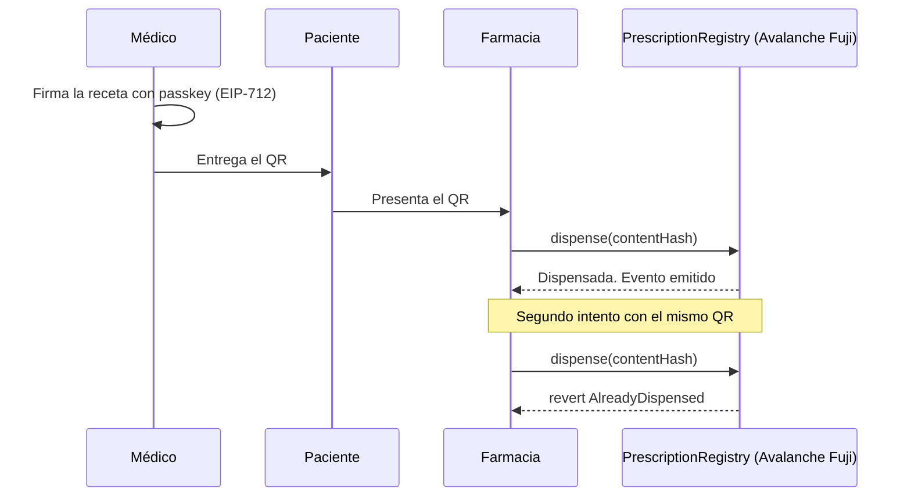

# 00 — Visión y alcance

Construimos una receta electrónica que no se puede usar dos veces. El médico la firma, la farmacia la verifica escaneando un QR y el contrato rechaza el segundo intento de dispensación. Todo lo demás (tratamiento crónico, trazabilidad de lotes, telemedicina, motor clínico completo) queda explícitamente fuera del MVP de tres días y documentado como fase posterior.

## La frase de una línea

> Una receta médica que la farmacia puede verificar en segundos y que el sistema impide reutilizar, sobre Ethereum, sin que el médico tenga que saber qué es una wallet.

## El problema

| Problema | Manifestación | Qué resuelve nuestro MVP |
|---|---|---|
| Receta apócrifa | Formulario falsificado o firmado por alguien sin matrícula | La farmacia comprueba on-chain que el emisor tiene una credencial profesional vigente |
| Reutilización | La misma receta se presenta en varias farmacias | El contrato marca la receta como dispensada; el segundo intento revierte |
| Errores de transcripción | Letra ilegible, dosis mal copiada | La receta viaja en formato estructurado, no en papel manuscrito |
| Sin evidencia de dispensación | Nadie puede probar después qué se entregó y cuándo | Cada dispensación es un evento con marca temporal y emisor verificable |

## Validación pendiente del problema

Esta es la debilidad más seria del proyecto y conviene decirla antes de que la diga el jurado.

El informe base se apoya en investigación del Laboratorio LIRE (Universidad de Constantine 2, Argelia) y en el concepto de *doctor shopping*, que es un fenómeno documentado principalmente en el contexto estadounidense de opioides. **No tenemos evidencia boliviana.** No existe en nuestra fuente ningún dato sobre incidencia de recetas falsificadas, reutilización o errores de transcripción en Cochabamba ni en Bolivia, y este documento no inventa ninguno.

> **Decisión pendiente — D-23**
> **Contexto.** Estamos diseñando una solución para un problema cuya magnitud local desconocemos. Si el problema real de las farmacias de Cochabamba es otro (por ejemplo, desabastecimiento o verificación de cobertura del seguro), la solución correcta es distinta.
> **Opciones.** (a) Entrevistar a médicos y farmacéuticos antes de continuar el desarrollo. (b) Continuar con la hipótesis actual y validar durante el piloto. (c) Reorientar el alcance según lo que aparezca en las entrevistas.
> **Recomendación.** Opción (a), en paralelo al buildathon: bastan cinco a diez conversaciones para saber si la hipótesis se sostiene. Presentar el proyecto declarando esta validación como pendiente es más creíble que presentar cifras sin fuente.
> **Impacto si se difiere.** Se construye una solución técnicamente correcta para un problema que quizá no es prioritario, y el piloto fracasa por falta de adopción, no por fallos técnicos.

### Guion de entrevista

**A farmacéuticos de Cochabamba**

1. ¿Cuántas recetas recibe al día y qué proporción llega en papel manuscrito?
2. ¿Ha rechazado alguna vez una receta por sospecha de falsificación? ¿Cómo lo detectó?
3. ¿Tiene forma de saber si esa receta ya fue dispensada en otra farmacia?
4. ¿Cuánto tiempo dedica a descifrar o confirmar por teléfono lo que dice una receta?
5. ¿Qué software de gestión usa hoy y quién decide cambiarlo?
6. ¿Qué tendría que pasar para que usted adoptara un sistema nuevo en el mostrador?
7. ¿Maneja sustancias controladas? ¿Cómo funciona en la práctica la receta valorada y el libro de control?
8. ¿Cuánto tiempo le lleva llevar los libros de estupefacientes y psicotrópicos, y qué revisa el SEDES cuando los inspecciona?

**A médicos**

9. ¿Cómo emite recetas hoy: talonario, plantilla impresa, sistema de la clínica?
10. ¿Le ha llegado alguna vez el reclamo de que alguien usó una receta suya?
11. ¿Usa firma digital ADSIB o algún certificado? ¿Para qué trámites?
12. ¿Cómo consigue los formularios de receta valorada y qué fricción le genera el trámite?
13. ¿Qué le haría abandonar el talonario de papel?

**A ambos**

14. ¿Qué pasa cuando se cae internet?
15. ¿Quién debería pagar por un sistema así: la clínica, la farmacia, la caja de salud, el paciente?

## Alcance del MVP (72 horas)

### Dentro

| Componente | Entregable demostrable |
|---|---|
| Contrato `PrescriptionRegistry` en Avalanche Fuji | `issue(bytes32 contentHash, bytes32 patientCommitment, uint64 expiresAt)` y `dispense(bytes32 contentHash)` de un solo uso |
| Credenciales profesionales | Attestations EAS para médicos y farmacias, con revocación |
| Aplicación del médico | Smart account ERC-4337, paymaster que patrocina el gas, firma EIP-712, generación de QR |
| Aplicación de la farmacia | Escaneo de QR, verificación on-chain, envío de la transacción de dispensación |
| Paciente | Recibe el QR. Sin wallet, sin cuenta, sin instalación |
| Almacenamiento off-chain | Receta cifrada fuera de la cadena; solo el hash va on-chain |
| Validación clínica mínima | Comprobación determinística de alergia declarada y duplicidad por ATC |

### El momento de la demo

> **Ese `revert` es la demo.** Los tres minutos se construyen alrededor del segundo escaneo rechazado. Todo lo demás es contexto para llegar a ese momento.

### Fuera del MVP (explícito)

| Fuera de alcance | Motivo | Dónde vuelve |
|---|---|---|
| Tratamiento crónico y dispensación fraccionada | Multiplica la complejidad del contrato y no aporta a la demo | [04, D-12](04-smart-contracts.md) y [Fase 2](09-roadmap.md) |
| Trazabilidad de unidades desde el laboratorio | Requiere serialización física, no códigos de clasificación | [Fase 3](09-roadmap.md) |
| Telemedicina y verificación biométrica | Depende de proveedores y de análisis legal | [Fase 3](09-roadmap.md) |
| Aseguradoras y reembolsos | Depende de acuerdos comerciales | [Fase 3](09-roadmap.md) |
| Wallet para el paciente | Añade fricción y no es necesaria para el flujo | [Fase 2](09-roadmap.md) |
| OCR de recetas en papel | Es contradictorio aplicar visión por computador a recetas que el propio sistema emite en digital | Solo migración de histórico, [Fase 3](09-roadmap.md) |
| Historia clínica completa | El alcance es la receta | Sin fecha |
| Blockchain de consorcio privada | Decisión revertida: corremos sobre una cadena pública sin permisos. Ver [01](01-arquitectura.md) | Solo como camino de producción a futuro |

## Corrección importante heredada de la fuente

> **Los códigos ATC clasifican fármacos; no rastrean unidades.**
> El informe base sugiere que la adopción de ATC habilita la trazabilidad del medicamento desde el laboratorio. Es un error conceptual. ATC dice que dos productos pertenecen al mismo grupo terapéutico, lo que sirve para detectar duplicidad e interacciones. Para saber que **esta caja concreta** salió de **este lote** hace falta serialización: GTIN, número de serie, lote y caducidad bajo estándares GS1. Son dos problemas distintos y este MVP solo aborda el primero. Ver [D-21](09-roadmap.md).

## Objetivos del MVP

Metas de diseño propuestas por este documento, no resultados medidos.

| Objetivo | Métrica | Meta |
|---|---|---|
| Verificación en mostrador | Tiempo desde escaneo hasta veredicto | `SUPUESTO:` por debajo de 5 s en Avalanche Fuji; se mide durante el desarrollo |
| Antirreutilización | Dispensaciones que exceden lo autorizado | 0, garantizado por el contrato |
| Fricción para el médico | AVAX que necesita comprar; extensiones que debe instalar | Cero y cero |
| Privacidad | Identificadores de paciente visibles on-chain | Ninguno, en ninguna forma |
| Coste por receta | Gas pagado por el médico | Cero: lo cubre el paymaster |

## Propuesta de valor por actor

| Actor | Qué gana | Qué cede |
|---|---|---|
| Médico | Firma sin talonario, sin wallet y sin gas; deja prueba de autoría | Su credencial profesional queda registrada como attestation |
| Farmacia | Verifica autenticidad y unicidad en segundos | Debe conectarse al sistema y enviar una transacción |
| Paciente | Receta legible que no se puede duplicar a su nombre | Nada: no instala nada ni gestiona claves en el MVP |
| Autoridad sanitaria | Base para vigilancia de sustancias controladas | Debe asumir el rol de emisor de credenciales. Ver [D-03](02-roles-y-permisos.md) |

## Supuestos y restricciones

| Tipo | Enunciado |
|---|---|
| `SUPUESTO:` | Existe una entidad dispuesta a emitir credenciales profesionales (Colegio Médico o autoridad sanitaria). Para el MVP el emisor lo simula el equipo |
| `SUPUESTO:` | La farmacia del piloto tiene un dispositivo con cámara y conexión a internet |
| `SUPUESTO:` | El piloto usa medicamentos no controlados |
| Restricción | Ningún identificador de paciente va on-chain, ni en claro ni como seudónimo estable |
| Restricción | El médico nunca adquiere AVAX ni firma una transacción cruda |
| Restricción | Lo que llamamos validación clínica es un motor de reglas determinístico, no IA. Ver [06](06-validacion-clinica.md) |
| Restricción | Sin evidencia publicada, ninguna cifra se presenta como propia |

## Siguiente paso

Continuar con [01-arquitectura.md](01-arquitectura.md).
