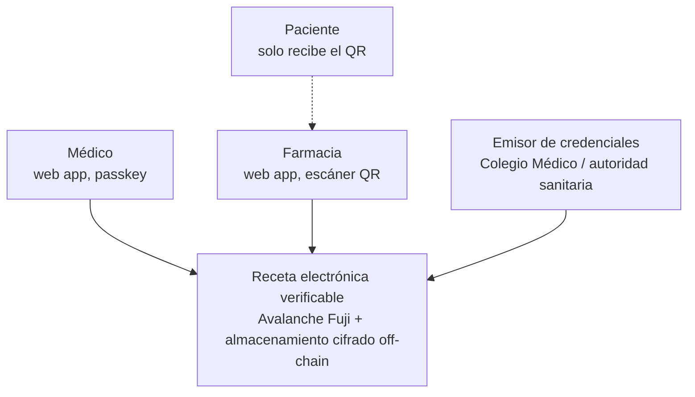
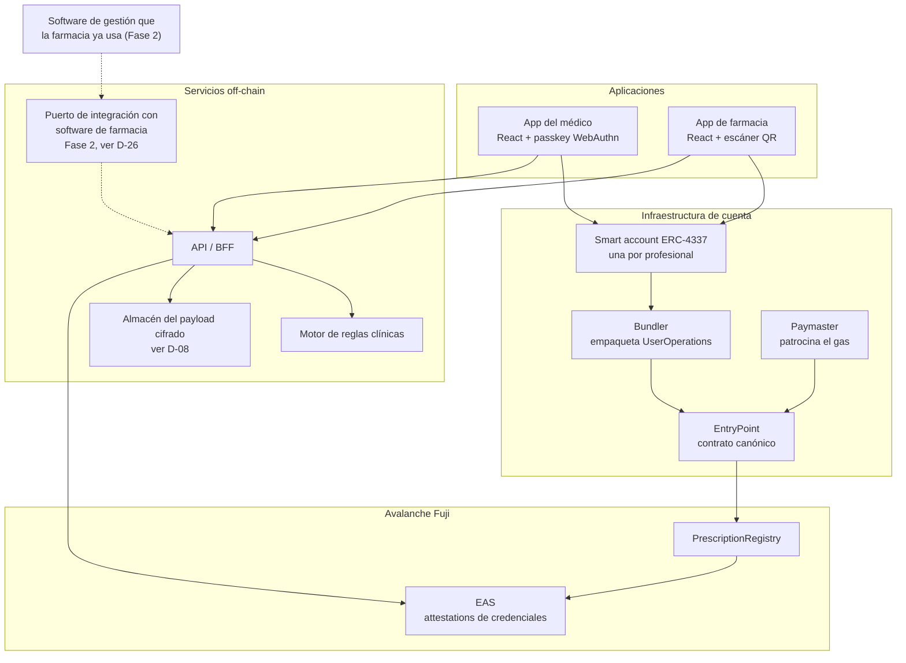
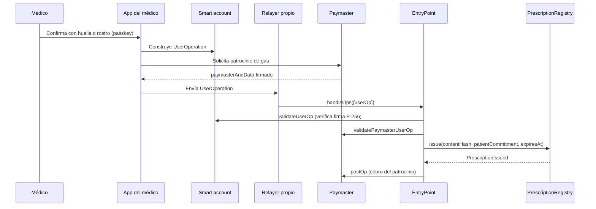
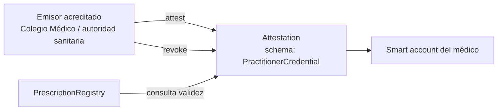

# 01 — Arquitectura

Corremos sobre **Avalanche Fuji**, la testnet de la C-Chain de Avalanche. Avalanche es una **L1 pública e independiente**, no una L2 de Ethereum: su C-Chain es compatible con EVM, pero no publica datos ni pruebas en Ethereum y no hereda su seguridad. Lo decimos así de claro porque cambia qué garantías puede prometer el sistema. Lo que no cambia es el resto: no hay blockchain de consorcio, no hay red privada, y la arquitectura sigue apoyándose en estándares del ecosistema Ethereum que corren igual sobre cualquier EVM. De esos estándares, **EIP-712 y EAS ya están construidos y en uso hoy**: el médico firma una estructura tipada y las credenciales profesionales son attestations verificadas en cada llamada. **Abstracción de cuenta (ERC-4337), paymaster y passkeys están construidos, pero sin desplegar y sin cablear**: existen `PasskeyAccount.sol`, `PasskeyAccountFactory.sol`, `PrescriptionPaymaster.sol`, un cliente de passkey en la app del médico y un relayer propio en la API, todos con sus pruebas; lo que no existe es un despliegue —ni fábrica, ni paymaster, ni depósito, ni stake— ni una sola llamada desde las aplicaciones. Hoy el médico firma con una wallet inyectada EIP-1193 (`eip1193-signer.adapter.ts`), tiene AVAX de prueba y ve el proveedor de esa wallet en pantalla.

## Decisión de cadena

| Red | Estado | Motivo |
|---|---|---|
| **Avalanche Fuji** | **Elegida** | Cadena EVM pública con el precompilado RIP-7212 comprobado en vivo, que es la condición dura de las passkeys. El resto del diseño —EIP-712, ERC-4337, EAS— es estándar EVM y no depende de que la cadena sea una L2. Ver también el track de Avalanche en [15](15-track-y-entrega.md) |
| Base Sepolia | Alternativa descartada | Era la elección anterior de este documento, por su tooling maduro de paymaster y passkeys. Se abandona al migrar a Avalanche |
| Arbitrum Sepolia | Alternativa equivalente | Ecosistema ERC-4337 sólido; cambiar implica reconfigurar bundler y paymaster |
| Scroll Sepolia | Alternativa equivalente | zkEVM con buen soporte de cuenta; menor densidad de proveedores de paymaster |

El `chainId` de Avalanche Fuji es 43113, confirmado contra el RPC público `https://api.avax-test.network/ext/bc/C/rpc`, y se fija en el dominio EIP-712. El explorador es `https://testnet.snowtrace.io` y la moneda nativa es AVAX, no ETH.

> **El coste honesto de esta decisión.**
> El motivo por el que este documento elegía Base era el tooling de bundler y paymaster de ERC-4337, maduro y documentado allí. Al migrar, ese motivo deja de aplicar y no se lo reemplaza por una afirmación equivalente sobre Avalanche. Se resolvió de otra forma: el proyecto escribió su propio paymaster y su propio relayer, así que no depende de la oferta de proveedores de Fuji. Lo que queda del coste es de operación, no de tooling —hay que desplegar y financiar ese paymaster, y D-02, más abajo, dice que quién lo financia sigue abierto—. Lo que sí está comprobado es el precompilado P-256, que es la pieza sin la cual las passkeys no tendrían un plan alternativo barato.

> **Por qué una cadena pública y no una red privada.**
> Una red de consorcio exige acuerdos de gobernanza, nodos operados por instituciones y un comité que no existe. En setenta y dos horas no se construye eso. Una cadena pública nos da finalidad rápida, coste bajo, herramientas maduras y verificabilidad por cualquiera, que es justamente lo que un jurado puede comprobar en vivo. Ese argumento nunca dependió de que la cadena fuese una L2: vale igual para una L1 pública como Avalanche.

### Camino de producción (post-buildathon)

> **Esta sección describe un futuro posible, no la arquitectura actual.**
> Si un regulador exigiera que los datos no residan en una red pública, existe una migración conocida: red permisionada Hyperledger Besu con consenso QBFT, anclando periódicamente la raíz de su estado en L1 de Ethereum para heredar inmutabilidad verificable externamente. Es un camino más caro y más lento, y no se adopta salvo que un requisito legal lo obligue.

> **Decisión pendiente — D-01**
> **Contexto.** Avalanche Fuji es testnet. Después del buildathon hay que decidir hacia dónde va el sistema.
> **Opciones.** (a) La C-Chain de Avalanche en mainnet, u otra cadena EVM pública en mainnet. (b) Red Besu permisionada anclada a L1. (c) Permanecer en testnet mientras dure la validación del problema.
> **Recomendación.** Opción (c) mientras se ejecuta la validación de [D-23](00-vision-y-alcance.md), luego (a). La opción (b) solo si aparece una exigencia normativa explícita.
> **Impacto si se difiere.** Ninguno a corto plazo; la decisión no bloquea el MVP.

## Vista de contexto



## Vista de contenedores



> El puerto de integración y el software de la farmacia aparecen con línea discontinua porque no existen en el MVP. Ver la capa de integraciones más abajo y [D-26](09-roadmap.md).

## Toolkit Ethereum-nativo

Esta sección es el núcleo técnico del proyecto. Cada pieza resuelve un problema concreto de adopción.

### Abstracción de cuenta (ERC-4337)

> **Construido, sin desplegar y sin cablear.**
> El código existe y pasa sus pruebas: `PasskeyAccount.sol`, `PasskeyAccountFactory.sol`, `PrescriptionPaymaster.sol` y el relayer propio de `services/api/src/relayer/`, que envía la operación. Lo que no existe es el despliegue —ni fábrica, ni paymaster, ni depósito, ni stake— y tampoco el cableado: las dos aplicaciones siguen firmando a través de una wallet inyectada EIP-1193 (`eip1193-signer.adapter.ts`), y ese `TODO` del propio archivo dice cuándo cambia. Cerrar la migración a una smart account respaldada por passkey es la Fase 5 de [18](18-tareas-por-fases.md) y depende además de la recuperación social descrita en [D-04](02-roles-y-permisos.md#d-04).

El médico no tiene una cuenta externa con clave privada que deba respaldar. Tiene una **smart account**: un contrato que valida operaciones según la lógica que nosotros definimos.



| Elemento | Función |
|---|---|
| `UserOperation` | Intención firmada por el usuario; no es una transacción de Ethereum todavía |
| `EntryPoint` | Contrato canónico que valida y ejecuta lotes de `UserOperation` |
| Bundler | Servicio que agrupa operaciones y paga el gas en la cadena. **Este proyecto no usa uno.** `handleOps` del EntryPoint v0.7 es `public` y sin control de acceso, así que un relayer propio (`services/api/src/relayer/`) envía cada operación suelta: sin mempool, sin agrupación, sin ERC-7562, sin reputación y sin stake. Por eso no se le llama bundler |
| Smart account | Contrato del médico; define qué firma considera válida |
| Paymaster | Contrato que se compromete a cubrir el gas de la operación |

**Alternativa: EIP-7702.** Permite que una cuenta externa delegue temporalmente en código de contrato, obteniendo capacidades de smart account sin desplegar una. Es más simple si el usuario ya tiene wallet. En nuestro caso el médico **no** tiene wallet, así que ERC-4337 con despliegue diferido de la cuenta encaja mejor. `VERIFICAR:` disponibilidad de EIP-7702 en Avalanche Fuji al momento del despliegue.

### Paymaster: el médico nunca compra ETH

El paymaster acepta pagar el gas de operaciones que cumplan una política. La nuestra es estricta:

| Regla de la política del paymaster | Motivo |
|---|---|
| Solo llamadas a `PrescriptionRegistry` | Evita que la cuenta se use para otra cosa |
| Solo desde smart accounts con attestation profesional vigente | El patrocinio es un privilegio de la credencial, no del usuario |
| Límite de operaciones por cuenta y por ventana de tiempo | Contención de abuso y de coste |
| Rechazo si la attestation está revocada | La revocación corta el acceso de inmediato |

> **Decisión pendiente — D-02**
> **Contexto.** En el buildathon el paymaster lo financia el equipo con ETH de testnet, que no vale nada. En producción alguien paga gas real por cada receta emitida.
> **Opciones.** (a) La clínica o la cadena farmacéutica deposita saldo y patrocina a sus profesionales. (b) La caja de salud o el ente público financia el patrocinio como servicio de salud digital. (c) Modelo mixto: gratuito hasta un umbral, luego por suscripción de la institución. (d) El paciente paga, opción descartada por razones de equidad.
> **Recomendación.** Opción (c), con (b) como objetivo si el piloto con un ente público prospera. El coste por operación en un L2 es lo bastante bajo para que el patrocinio sea viable, pero esa afirmación debe medirse, no asumirse. Ver [13 Pitch y sostenibilidad](13-pitch-y-sostenibilidad.md).
> **Impacto si se difiere.** El pitch no puede responder "quién paga el gas", que es una de las preguntas seguras del jurado. Ver [12](12-preguntas-de-jurado.md).

### Passkeys y WebAuthn: el médico no ve una wallet

> **Estado: construido, sin cablear.** Las dos mitades existen. En cadena, `contracts/src/WebAuthn.sol` reconstruye el mensaje que el autenticador firmó de verdad y `contracts/src/P256.sol` verifica la curva; `PasskeyAccount` ya las usa. En el navegador, `apps/doctor/src/infrastructure/passkey/` corre las dos ceremonias sobre `@simplewebauthn/browser` detrás de `PasskeyPort`. Lo que falta es el uso: ninguna pantalla llama a ese puerto y los dos composition roots siguen construyendo `createEip1193Signer`, así que hoy se firma con una wallet del navegador. Ver [D-04](02-roles-y-permisos.md#d-04).

La clave del médico será una passkey del dispositivo: se genera en el enclave seguro del teléfono o del portátil y se usa con huella, rostro o PIN. No hay frase semilla que memorizar ni extensión que instalar.

| Pieza | Detalle |
|---|---|
| Curva | secp256r1 (P-256), la que usan WebAuthn y los enclaves seguros |
| Problema | El EVM verifica de forma nativa secp256k1, no P-256 |
| Solución | **RIP-7212**, precompilado de verificación de firmas P-256, adoptado por varias cadenas EVM, entre ellas la C-Chain de Avalanche |
| Alternativa | Verificación de P-256 en Solidity, correcta pero mucho más costosa en gas |

El precompilado RIP-7212 está presente y operativo en Avalanche Fuji en `0x0000000000000000000000000000000000000100`, comprobado con una firma P-256 generada localmente (ver [16](16-plan-de-ejecucion.md)). El plan alternativo —una biblioteca de verificación P-256 en Solidity, con mayor consumo de gas cubierto por el paymaster— queda descartado salvo que el precompilado deje de estar disponible.

### EIP-712: el médico firma algo legible

El médico no firma una cadena hexadecimal. Firma una estructura tipada que su navegador muestra en texto claro: quién prescribe, qué caduca cuándo, sobre qué compromiso de contenido.

Además, la firma es **off-chain**: el médico firma la estructura tipada y el QR la transporta. En el MVP tal como está construido, la aplicación del médico registra la emisión on-chain en ese mismo momento con la cuenta de su wallet inyectada EIP-1193 (ver la secuencia de emisión en [05](05-almacenamiento-y-cifrado.md)); no hay ningún paymaster desplegado, así que esa cuenta paga el gas de `issue` con AVAX de prueba. Que el médico no pague ni espere depende de desplegar y financiar el paymaster (D-02), no de escribirlo: el contrato ya existe. Hasta que eso ocurra, esta parte describe el objetivo, no el MVP corriendo. Existe una variante diferida, documentada en [04](04-smart-contracts.md), en la que la farmacia envía la firma junto con la dispensación y emitir no cuesta gas: queda fuera del MVP porque impide verificar la receta antes de que llegue al mostrador.

```solidity
// EIP-712 typed data signed by the prescriber, off-chain
struct Prescription {
    bytes32 contentHash;        // keccak256 of the encrypted document
    bytes32 patientCommitment;  // keccak256(patientId, salt) - salt never leaves off-chain storage
    address prescriber;         // smart account address of the practitioner
    uint64  issuedAt;
    uint64  expiresAt;
    uint256 nonce;              // per-prescriber, prevents replay
}

// Domain separator
// EIP712Domain(
//   string  name              = "RecetaVerificable",
//   string  version           = "1",
//   uint256 chainId           = 43113,            // Avalanche Fuji
//   address verifyingContract = <PrescriptionRegistry>
// )
```

> `patientCommitment` es un compromiso con sal, no un identificador. Ver [03 Modelo de datos](03-modelo-de-datos.md).

### EAS: quién certifica que una dirección es un médico real

Las credenciales profesionales se emiten como **attestations** en Ethereum Attestation Service. Una attestation es una afirmación firmada por un emisor sobre un sujeto, con esquema tipado y revocación.



**Esquema propuesto para profesionales**

```
schema PractitionerCredential:
  string  licenseNumber     // professional registration number
  string  specialtyCode
  address issuerAuthority
  uint64  validFrom
  uint64  validUntil
```

**Esquema propuesto para farmacias**

```
schema PharmacyCredential:
  string  pharmacyLicense
  string  sanitaryRegistryRef
  address issuerAuthority
  uint64  validFrom
  uint64  validUntil
```

| Propiedad | Diseño |
|---|---|
| Revocación | El emisor llama a `revoke`; el contrato comprueba `revocationTime == 0` y `validUntil` en cada uso |
| Efecto de la revocación | Un médico que pierde la matrícula deja de poder emitir de inmediato, sin migración ni despliegue |
| Verificabilidad pública | Cualquiera puede comprobar la credencial de una dirección sin pedirnos permiso |
| Datos personales | La attestation contiene número de matrícula, que es dato profesional público. No contiene datos de salud ni del paciente |

**EAS aquí es un despliegue propio del proyecto, no la instancia canónica.** Avalanche no tiene un despliegue oficial de EAS: el repositorio `ethereum-attestation-service/eas-contracts` publica `deployments/` para 26 redes y ninguna es Avalanche, así que no hay dirección canónica que asumir ni predeploy que dar por hecho. `contracts/script/DeployEAS.s.sol` despliega EAS **v1.2.0** —la misma versión de la que está transcrito `contracts/src/IEAS.sol`— en dos pasos: primero `SchemaRegistry`, después `EAS(schemaRegistry)`, porque `EAS` recibe el registro en el constructor y revierte con la dirección cero. Ambos contratos responden `version()` igual a `1.2.0`, que es la comprobación barata de que lo desplegado es lo esperado.

Las dos direcciones son propias de cada despliegue y viajan por configuración (`EAS_ADDRESS`, `SCHEMA_REGISTRY_ADDRESS`), nunca escritas en el código. Los uids de los dos esquemas los imprime `contracts/script/RegisterSchemas.s.sol` y **no coinciden** con los stand-ins locales de `contracts/script/LocalDemo.sol`: el registro real deriva el uid de `keccak256(abi.encodePacked(schema, resolver, revocable))`, mientras que la demo sobre Anvil usa el hash de la declaración. Ver [19](19-despliegue.md).

### Recuperación social

Si el médico pierde el teléfono, pierde la passkey. La smart account incorpora recuperación por guardianes. Ver [D-04](02-roles-y-permisos.md).

## Privacidad de metadatos

Esta es la contrapartida honesta de elegir una cadena pública, y el documento no la esquiva.

> **El contenido está cifrado, pero el grafo de transacciones no.**
> En una cadena pública cualquiera puede observar que la dirección A emite treinta recetas por semana, que la dirección B las dispensa el mismo día y a qué hora. Si A es un oncólogo identificable y B una farmacia de barrio, el patrón de dispensación es información de salud aunque nunca se escriba un nombre. Esto no es un detalle: es el riesgo de privacidad más real del diseño.

| Fuga | Mitigación en el MVP | Mitigación futura |
|---|---|---|
| Identificador de paciente | **Regla dura: nunca on-chain**, ni en claro, ni cifrado, ni como seudónimo estable. Solo `keccak256(patientId, salt)` con sal distinta por receta | Pruebas de conocimiento cero para verificar pertenencia sin revelar el compromiso |
| Dirección del médico correlacionable | Ninguna en el MVP: la dirección del médico es estable por diseño, porque su credencial lo es | Emisión delegada mediante direcciones seudónimas por receta, con la credencial demostrada por prueba |
| Volumen y horario de dispensación | Ninguna | Agregación por lotes, retardo aleatorio en el envío |
| Relación médico-farmacia | Ninguna | ZK: probar "el emisor tiene credencial vigente" sin revelar cuál |

> **Un compromiso con sal única por receta impide correlacionar recetas del mismo paciente.** Es también lo que rompe la agregación de historial, que sí es un objetivo a futuro por vía off-chain ([D-25](06-validacion-clinica.md)), y lo que cancela la analítica poblacional por paciente; lo que queda posible en su lugar se detalla en [03](03-modelo-de-datos.md). El MVP prioriza privacidad sobre agregación de forma deliberada.

## Capas y responsabilidades

| Capa | Hace | No hace |
|---|---|---|
| Aplicaciones | Capturar, firmar con passkey, escanear | No contienen la regla antirreutilización |
| Cuenta y patrocinio | Validar firma P-256, patrocinar gas según política | No custodian contenido clínico |
| Cadena (Avalanche Fuji) | Estado autoritativo de la receta y credenciales | No almacena datos personales |
| Off-chain | Payload cifrado, motor de reglas, proyección de lectura | No decide si una receta se puede dispensar |
| Integraciones (Fase 2) | Exponer la receta al software que la farmacia ya usa en el mostrador. Ver [D-26](09-roadmap.md) | No decide nada por sí misma; reutiliza el contrato y las credenciales |

### Capa de integraciones (Fase 2)

No existe en el MVP. Se declara aquí para que el diseño tenga el lugar donde encajar lo que [D-26](09-roadmap.md) decide: sin este puerto, la adopción repite el obstáculo que [10](10-estado-del-arte.md) atribuye a Prescrypto.

| Puerto | Qué hace | Adaptador previsto | Fase |
|---|---|---|---|
| `PharmacySoftwarePort` | Permite que el software de gestión que la farmacia ya usa consulte una receta por `contentHash` y registre la dispensación sin abrir nuestra aplicación | API HTTP autenticada con la credencial de la farmacia; la smart account de la farmacia firma la `UserOperation` por detrás. El adaptador concreto se diseña después del relevamiento de la Fase 1 de [09](09-roadmap.md) | 2 |
| `FhirExportPort` | Expone recetas y dispensaciones como recursos HL7 FHIR R4 para el sector público | Servidor FHIR sobre la correspondencia de [03](03-modelo-de-datos.md) | 3 |

> La integración nunca sustituye la verificación on-chain ni la credencial. El software de la farmacia es una interfaz más sobre el mismo contrato y la misma smart account; si el adaptador falla, la aplicación independiente sigue funcionando.

## Atributos de calidad

| Atributo | Exigencia | Táctica |
|---|---|---|
| Unicidad de dispensación | Imposible dispensar dos veces | Estado en contrato, `revert` en el segundo intento |
| Fricción cero para el médico | Sin ETH, sin extensión, sin frase semilla | Smart account + paymaster + passkey |
| Verificabilidad pública | Cualquiera comprueba emisor y estado | Cadena pública + EAS propio del proyecto |
| Privacidad del paciente | Nada identificable on-chain | Compromiso con sal, cifrado off-chain |
| Legalidad en Bolivia | Firma con validez jurídica local | Doble firma ADSIB, ver [07](07-seguridad-y-cumplimiento.md) |
| Operación con red degradada | La farmacia no se bloquea | Ver [D-20](04-smart-contracts.md) |

## Siguiente paso

Continuar con [02-roles-y-permisos.md](02-roles-y-permisos.md).
