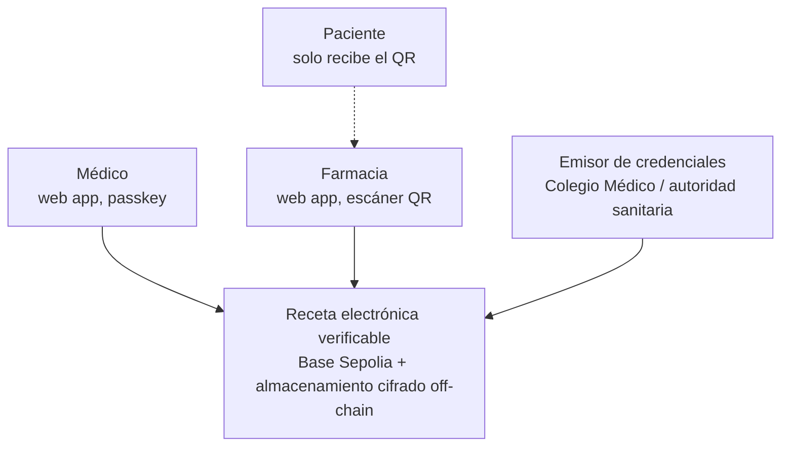
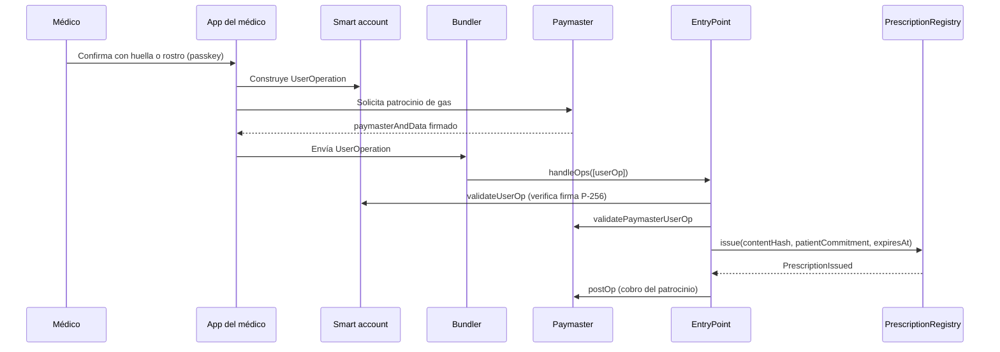
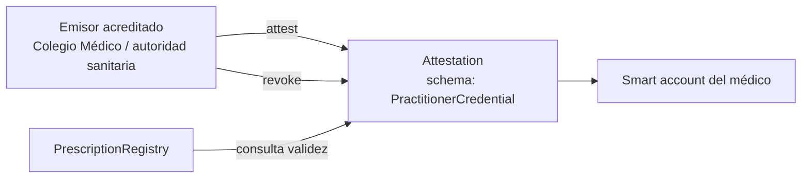

# 01 — Arquitectura

Corremos sobre **Base Sepolia**, un L2 público de Ethereum. No hay blockchain de consorcio, no hay red privada y no hay ambigüedad: la decisión está tomada y el resto del documento la asume. La arquitectura se apoya en cuatro piezas nativas de Ethereum que juntas hacen que un médico pueda firmar una receta sin tener ETH, sin instalar una extensión y sin ver nunca la palabra "wallet": abstracción de cuenta, paymaster, passkeys y EIP-712.

## Decisión de cadena

| Red | Estado | Motivo |
|---|---|---|
| **Base Sepolia** | **Elegida** | Mejor tooling disponible hoy para paymaster y passkeys, documentación madura y despliegue rápido en el plazo del buildathon |
| Arbitrum Sepolia | Alternativa equivalente | Ecosistema ERC-4337 sólido; cambiar implica reconfigurar bundler y paymaster |
| Scroll Sepolia | Alternativa equivalente | zkEVM con buen soporte de cuenta; menor densidad de proveedores de paymaster |

`SUPUESTO:` el `chainId` de Base Sepolia es 84532. Se confirma en el primer despliegue con Foundry y se fija en el dominio EIP-712.

> **Por qué un L2 público y no una red privada.**
> Una red de consorcio exige acuerdos de gobernanza, nodos operados por instituciones y un comité que no existe. En setenta y dos horas no se construye eso. Un L2 público nos da finalidad rápida, coste bajo, herramientas maduras y verificabilidad por cualquiera, que es justamente lo que un jurado puede comprobar en vivo.

### Camino de producción (post-buildathon)

> **Esta sección describe un futuro posible, no la arquitectura actual.**
> Si un regulador exigiera que los datos no residan en una red pública, existe una migración conocida: red permisionada Hyperledger Besu con consenso QBFT, anclando periódicamente la raíz de su estado en L1 de Ethereum para heredar inmutabilidad verificable externamente. Es un camino más caro y más lento, y no se adopta salvo que un requisito legal lo obligue.

> **Decisión pendiente — D-01**
> **Contexto.** Base Sepolia es testnet. Después del buildathon hay que decidir hacia dónde va el sistema.
> **Opciones.** (a) Base mainnet u otro L2 en mainnet. (b) Red Besu permisionada anclada a L1. (c) Permanecer en testnet mientras dure la validación del problema.
> **Recomendación.** Opción (c) mientras se ejecuta la validación de [D-23](00-vision-y-alcance.md), luego (a). La opción (b) solo si aparece una exigencia normativa explícita.
> **Impacto si se difiere.** Ninguno a corto plazo; la decisión no bloquea el MVP.

## Vista de contexto



## Vista de contenedores


> El puerto de integración y el software de la farmacia aparecen con línea discontinua porque no existen en el MVP. Ver la capa de integraciones más abajo y [D-26](09-roadmap.md).

## Toolkit Ethereum-nativo

Esta sección es el núcleo técnico del proyecto. Cada pieza resuelve un problema concreto de adopción.

### Abstracción de cuenta (ERC-4337)

El médico no tiene una cuenta externa con clave privada que deba respaldar. Tiene una **smart account**: un contrato que valida operaciones según la lógica que nosotros definimos.



| Elemento | Función |
|---|---|
| `UserOperation` | Intención firmada por el usuario; no es una transacción de Ethereum todavía |
| `EntryPoint` | Contrato canónico que valida y ejecuta lotes de `UserOperation` |
| Bundler | Servicio que agrupa operaciones y paga el gas en la cadena |
| Smart account | Contrato del médico; define qué firma considera válida |
| Paymaster | Contrato que se compromete a cubrir el gas de la operación |

**Alternativa: EIP-7702.** Permite que una cuenta externa delegue temporalmente en código de contrato, obteniendo capacidades de smart account sin desplegar una. Es más simple si el usuario ya tiene wallet. En nuestro caso el médico **no** tiene wallet, así que ERC-4337 con despliegue diferido de la cuenta encaja mejor. `VERIFICAR:` disponibilidad de EIP-7702 en Base Sepolia al momento del despliegue.

### Paymaster: el médico nunca compra ETH

El paymaster acepta pagar el gas de operaciones que cumplan una política. La nuestra es estricta:

| Regla de la política del paymaster | Motivo |
|---|---|
| Solo llamadas a `PrescriptionRegistry` | Evita que la cuenta se use para otra cosa |
| Solo desde smart accounts con attestation profesional vigente | El patrocinio es un privilegio de la credencial, no del usuario |
| Límite de operaciones por cuenta y por ventana de tiempo | Contención de abuso y de coste |
| Rechazo si la attestation está revocada | La revocación corta el acceso de inmediato |

> **Decisión pendiente — D-02**
> **Contexto.** En el buildathon el paymaster lo financia el equipo con ETH de testnet, que no vale nada. En producción alguien paga gas real por cada receta emitida.
> **Opciones.** (a) La clínica o la cadena farmacéutica deposita saldo y patrocina a sus profesionales. (b) La caja de salud o el ente público financia el patrocinio como servicio de salud digital. (c) Modelo mixto: gratuito hasta un umbral, luego por suscripción de la institución. (d) El paciente paga, opción descartada por razones de equidad.
> **Recomendación.** Opción (c), con (b) como objetivo si el piloto con un ente público prospera. El coste por operación en un L2 es lo bastante bajo para que el patrocinio sea viable, pero esa afirmación debe medirse, no asumirse. Ver [13 Pitch y sostenibilidad](13-pitch-y-sostenibilidad.md).
> **Impacto si se difiere.** El pitch no puede responder "quién paga el gas", que es una de las preguntas seguras del jurado. Ver [12](12-preguntas-de-jurado.md).

### Passkeys y WebAuthn: el médico no ve una wallet

La clave del médico es una passkey del dispositivo: se genera en el enclave seguro del teléfono o del portátil y se usa con huella, rostro o PIN. No hay frase semilla que memorizar ni extensión que instalar.

| Pieza | Detalle |
|---|---|
| Curva | secp256r1 (P-256), la que usan WebAuthn y los enclaves seguros |
| Problema | El EVM verifica de forma nativa secp256k1, no P-256 |
| Solución | **RIP-7212**, precompilado de verificación de firmas P-256, disponible en varios L2 incluida la familia OP Stack |
| Alternativa | Verificación de P-256 en Solidity, correcta pero mucho más costosa en gas |

`VERIFICAR:` presencia del precompilado RIP-7212 en Base Sepolia antes de fijar la implementación. Si no estuviera, el plan alternativo es una biblioteca de verificación P-256 en Solidity, asumiendo mayor consumo de gas cubierto por el paymaster.

### EIP-712: el médico firma algo legible

El médico no firma una cadena hexadecimal. Firma una estructura tipada que su navegador muestra en texto claro: quién prescribe, qué caduca cuándo, sobre qué compromiso de contenido.

Además, la firma es **off-chain**: el médico firma la estructura tipada y el QR la transporta. En el MVP, la API registra la emisión on-chain en ese mismo momento a través del paymaster (ver la secuencia de emisión en [05](05-almacenamiento-y-cifrado.md)); el médico no paga ni espera, pero la transacción de `issue` sí ocurre. Existe una variante diferida, documentada en [04](04-smart-contracts.md), en la que la farmacia envía la firma junto con la dispensación y emitir no cuesta gas: queda fuera del MVP porque impide verificar la receta antes de que llegue al mostrador.

```solidity
// EIP-712 typed data signed by the prescriber, off-chain
struct Prescription {
    bytes32 contentHash;        // keccak256 of the encrypted document
    bytes32 patientCommitment;  // keccak256(patientId, salt) - salt never leaves off-chain storage
    address prescriber;         // smart account address of the practitioner
    uint64  issuedAt;
    uint64  expiresAt;
    uint256 nonce;              // per-prescriber, prevents replay
}

// Domain separator
// EIP712Domain(
//   string  name              = "RecetaVerificable",
//   string  version           = "1",
//   uint256 chainId           = 84532,            // Base Sepolia
//   address verifyingContract = <PrescriptionRegistry>
// )
```

> `patientCommitment` es un compromiso con sal, no un identificador. Ver [03 Modelo de datos](03-modelo-de-datos.md).

### EAS: quién certifica que una dirección es un médico real

Las credenciales profesionales se emiten como **attestations** en Ethereum Attestation Service. Una attestation es una afirmación firmada por un emisor sobre un sujeto, con esquema tipado y revocación.



**Esquema propuesto para profesionales**

```
schema PractitionerCredential:
  string  licenseNumber     // professional registration number
  string  specialtyCode
  address issuerAuthority
  uint64  validFrom
  uint64  validUntil
```

**Esquema propuesto para farmacias**

```
schema PharmacyCredential:
  string  pharmacyLicense
  string  sanitaryRegistryRef
  address issuerAuthority
  uint64  validFrom
  uint64  validUntil
```

| Propiedad | Diseño |
|---|---|
| Revocación | El emisor llama a `revoke`; el contrato comprueba `revocationTime == 0` y `validUntil` en cada uso |
| Efecto de la revocación | Un médico que pierde la matrícula deja de poder emitir de inmediato, sin migración ni despliegue |
| Verificabilidad pública | Cualquiera puede comprobar la credencial de una dirección sin pedirnos permiso |
| Datos personales | La attestation contiene número de matrícula, que es dato profesional público. No contiene datos de salud ni del paciente |

`VERIFICAR:` direcciones de los contratos de EAS en Base Sepolia antes del despliegue. No se citan aquí para no fijar valores sin comprobar.

### Recuperación social

Si el médico pierde el teléfono, pierde la passkey. La smart account incorpora recuperación por guardianes. Ver [D-04](02-roles-y-permisos.md).

## Privacidad de metadatos

Esta es la contrapartida honesta de elegir una cadena pública, y el documento no la esquiva.

> **El contenido está cifrado, pero el grafo de transacciones no.**
> En una cadena pública cualquiera puede observar que la dirección A emite treinta recetas por semana, que la dirección B las dispensa el mismo día y a qué hora. Si A es un oncólogo identificable y B una farmacia de barrio, el patrón de dispensación es información de salud aunque nunca se escriba un nombre. Esto no es un detalle: es el riesgo de privacidad más real del diseño.

| Fuga | Mitigación en el MVP | Mitigación futura |
|---|---|---|
| Identificador de paciente | **Regla dura: nunca on-chain**, ni en claro, ni cifrado, ni como seudónimo estable. Solo `keccak256(patientId, salt)` con sal distinta por receta | Pruebas de conocimiento cero para verificar pertenencia sin revelar el compromiso |
| Dirección del médico correlacionable | Ninguna en el MVP: la dirección del médico es estable por diseño, porque su credencial lo es | Emisión delegada mediante direcciones seudónimas por receta, con la credencial demostrada por prueba |
| Volumen y horario de dispensación | Ninguna | Agregación por lotes, retardo aleatorio en el envío |
| Relación médico-farmacia | Ninguna | ZK: probar "el emisor tiene credencial vigente" sin revelar cuál |

> **Un compromiso con sal única por receta impide correlacionar recetas del mismo paciente.** Es también lo que rompe la agregación de historial, que sí es un objetivo a futuro por vía off-chain ([D-25](06-validacion-clinica.md)), y lo que cancela la analítica poblacional por paciente; lo que queda posible en su lugar se detalla en [03](03-modelo-de-datos.md). El MVP prioriza privacidad sobre agregación de forma deliberada.

## Capas y responsabilidades

| Capa | Hace | No hace |
|---|---|---|
| Aplicaciones | Capturar, firmar con passkey, escanear | No contienen la regla antirreutilización |
| Cuenta y patrocinio | Validar firma P-256, patrocinar gas según política | No custodian contenido clínico |
| Cadena (Base Sepolia) | Estado autoritativo de la receta y credenciales | No almacena datos personales |
| Off-chain | Payload cifrado, motor de reglas, proyección de lectura | No decide si una receta se puede dispensar |
| Integraciones (Fase 2) | Exponer la receta al software que la farmacia ya usa en el mostrador. Ver [D-26](09-roadmap.md) | No decide nada por sí misma; reutiliza el contrato y las credenciales |

### Capa de integraciones (Fase 2)

No existe en el MVP. Se declara aquí para que el diseño tenga el lugar donde encajar lo que [D-26](09-roadmap.md) decide: sin este puerto, la adopción repite el obstáculo que [10](10-estado-del-arte.md) atribuye a Prescrypto.

| Puerto | Qué hace | Adaptador previsto | Fase |
|---|---|---|---|
| `PharmacySoftwarePort` | Permite que el software de gestión que la farmacia ya usa consulte una receta por `contentHash` y registre la dispensación sin abrir nuestra aplicación | API HTTP autenticada con la credencial de la farmacia; la smart account de la farmacia firma la `UserOperation` por detrás. El adaptador concreto se diseña después del relevamiento de la Fase 1 de [09](09-roadmap.md) | 2 |
| `FhirExportPort` | Expone recetas y dispensaciones como recursos HL7 FHIR R4 para el sector público | Servidor FHIR sobre la correspondencia de [03](03-modelo-de-datos.md) | 3 |

> La integración nunca sustituye la verificación on-chain ni la credencial. El software de la farmacia es una interfaz más sobre el mismo contrato y la misma smart account; si el adaptador falla, la aplicación independiente sigue funcionando.

## Atributos de calidad

| Atributo | Exigencia | Táctica |
|---|---|---|
| Unicidad de dispensación | Imposible dispensar dos veces | Estado en contrato, `revert` en el segundo intento |
| Fricción cero para el médico | Sin ETH, sin extensión, sin frase semilla | Smart account + paymaster + passkey |
| Verificabilidad pública | Cualquiera comprueba emisor y estado | L2 público + EAS |
| Privacidad del paciente | Nada identificable on-chain | Compromiso con sal, cifrado off-chain |
| Legalidad en Bolivia | Firma con validez jurídica local | Doble firma ADSIB, ver [07](07-seguridad-y-cumplimiento.md) |
| Operación con red degradada | La farmacia no se bloquea | Ver [D-20](04-smart-contracts.md) |

## Siguiente paso

Continuar con [02-roles-y-permisos.md](02-roles-y-permisos.md).
