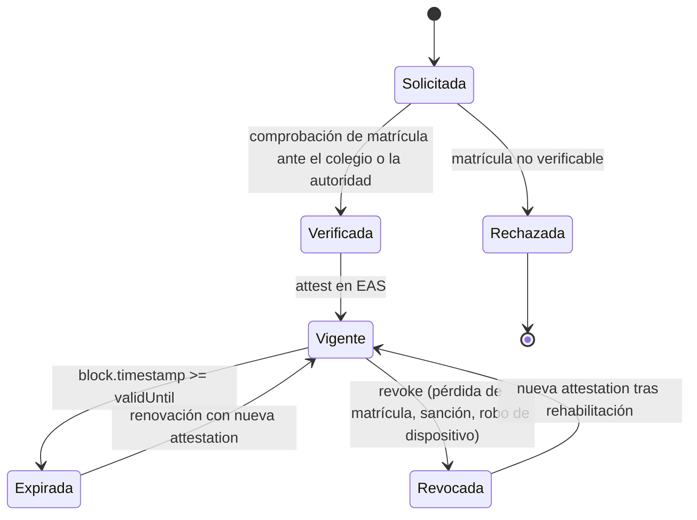

# 02 — Roles y permisos

La autorización se resuelve con una pregunta: ¿esta dirección tiene una attestation profesional vigente y no revocada? El contrato la responde consultando EAS antes de permitir emitir o dispensar. No hay listas blancas mantenidas a mano, no hay roles en base de datos y no hay administrador que pueda emitir recetas.

## Actores

| Actor | Identidad técnica | Acreditado por | Puede |
|---|---|---|---|
| Médico | Smart account ERC-4337 con passkey | Attestation `PractitionerCredential` | Firmar recetas (EIP-712, off-chain) |
| Farmacia | Smart account ERC-4337 | Attestation `PharmacyCredential` | Enviar la transacción de dispensación |
| Paciente | Ninguna en el MVP | No aplica | Recibir y presentar el QR |
| Emisor de credenciales | Cuenta multifirma | Constitución del piloto | Emitir y revocar attestations |
| Operador del paymaster | Cuenta de servicio | Equipo del proyecto | Definir y financiar la política de patrocinio |

> **El paciente no tiene wallet en el MVP.** Es una decisión de producto, no una limitación técnica: añadir gestión de claves al paciente multiplica la fricción y no aporta nada a la demo. Vuelve en [Fase 2](09-roadmap.md), cuando el paciente necesite controlar quién lee su historial.

## Autoridad sanitaria y pagadores: qué reciben

El informe base asignaba a gobierno y aseguradoras la función de "supervisar tendencias de salud pública y procesar reembolsos mediante accesos auditables". Ninguno de los dos actores existe en el MVP y, cuando aparezcan, lo que pueden recibir está acotado por la regla dura de [03](03-modelo-de-datos.md).

| Lo que el informe base prometía | Lo que el diseño permite | Por qué |
|---|---|---|
| Tendencias de salud pública por paciente o por cohorte | **No.** Ni ahora ni en fases posteriores | La sal única por receta impide agrupar las recetas de una persona; es el objetivo de la regla, no un efecto secundario |
| Supervisión agregada | Agregados por prescriptor, por farmacia, por código ATC y por periodo, sin identidad de paciente | Se calculan a partir de eventos on-chain, que ya son públicos, y del registro off-chain con acceso autorizado |
| Reembolsos | Evidencia verificable de emisión y dispensación por receta, presentada por la farmacia o por el paciente | Fuera del MVP; depende de acuerdos con cada pagador. Ver [13](13-pitch-y-sostenibilidad.md) |
| Accesos auditables | Todo acceso al documento cifrado queda registrado off-chain | Ver [07](07-seguridad-y-cumplimiento.md) |

## Matriz de permisos

Leyenda: ✅ permitido, ⚠️ con condición, ❌ prohibido.

| Operación | Médico | Farmacia | Emisor | Operador paymaster | Paciente |
|---|---|---|---|---|---|
| Firmar receta (EIP-712) | ⚠️ con credencial vigente | ❌ | ❌ | ❌ | ❌ |
| `issue` on-chain | ⚠️ opcional, ver nota | ⚠️ al dispensar | ❌ | ❌ | ❌ |
| `dispense` | ❌ | ⚠️ con credencial vigente y receta no dispensada | ❌ | ❌ | ❌ |
| `cancel` | ⚠️ solo el emisor de esa receta y antes de dispensar | ❌ | ❌ | ❌ | ❌ |
| Emitir attestation | ❌ | ❌ | ✅ | ❌ | ❌ |
| Revocar attestation | ❌ | ❌ | ✅ | ❌ | ❌ |
| Descifrar el contenido de la receta | ⚠️ la que emitió | ⚠️ la que le presentan | ❌ | ❌ | ⚠️ vía QR, ver [05](05-almacenamiento-y-cifrado.md) |
| Cambiar la política del paymaster | ❌ | ❌ | ❌ | ✅ | ❌ |
| Actualizar el contrato | ❌ | ❌ | ❌ | ❌ | ❌ |

> **Nota sobre `issue`.** El médico firma off-chain. El registro on-chain puede hacerse en ese momento (el médico emite, patrocinado por el paymaster) o diferirse a la dispensación (la farmacia presenta firma y datos, y el contrato verifica la firma EIP-712). El MVP implementa el registro en el momento de la emisión porque hace la demo más legible; la variante diferida queda documentada en [04](04-smart-contracts.md).

## Condiciones evaluadas en el contrato

| Condición | Dónde se evalúa |
|---|---|
| Attestation existe y su `revocationTime` es cero | `PrescriptionRegistry` contra EAS |
| `block.timestamp` dentro de `validFrom` y `validUntil` de la credencial | `PrescriptionRegistry` |
| El emisor de la attestation es el emisor autorizado del piloto | `PrescriptionRegistry` |
| La receta no fue dispensada | `PrescriptionRegistry` |
| `block.timestamp < expiresAt` | `PrescriptionRegistry` |
| Firma EIP-712 válida para el `prescriber` declarado | `PrescriptionRegistry` (variante diferida) |

## Ciclo de vida de una credencial

| Evento real | Efecto técnico | Latencia |
|---|---|---|
| El médico pierde la matrícula | El emisor revoca la attestation | Inmediata: la siguiente emisión revierte |
| Le roban el teléfono | Recuperación social y rotación de la passkey; ver [D-04](#d-04) | Depende de los guardianes |
| La credencial caduca | Deja de emitir hasta renovar | Inmediata |
| El emisor se equivoca | Revoca y vuelve a emitir | Inmediata |

> **Lo que la revocación no deshace.** Las recetas ya emitidas por ese médico siguen siendo válidas y dispensables hasta su caducidad. Revocar la credencial no invalida retroactivamente lo firmado antes, igual que retirar una licencia no anula las recetas escritas la semana anterior. Si se necesita invalidación retroactiva, es una decisión de producto que hoy no está implementada.

> **Decisión pendiente — D-03**
> **Contexto.** Alguien tiene que ser la autoridad que afirma "esta dirección es un médico con matrícula vigente". En el MVP ese emisor lo simula el equipo, lo que es honesto para una demo pero inaceptable en producción.
> **Opciones.** (a) Colegio Médico departamental o nacional como emisor. (b) Ministerio de Salud o SEDES Cochabamba. (c) La propia clínica emite credenciales para sus profesionales, con el colegio como emisor de segundo nivel. (d) Emisor operado por el proyecto, con acuerdos bilaterales.
> **Recomendación.** Opción (a) como objetivo natural, ya que el colegio es quien ya mantiene el registro de matrículas, con (c) como puente para el piloto porque una clínica decide más rápido que una institución colegiada. La opción (d) reintroduce el intermediario de confianza que el proyecto pretende evitar.
> **Impacto si se difiere.** El pitch queda sin respuesta para "quién certifica que una dirección es un médico real", que es una pregunta segura del jurado. Ver [12](12-preguntas-de-jurado.md).

> **Decisión pendiente — D-04**
> **Contexto.** La passkey vive en un dispositivo. Si el dispositivo se pierde, se rompe o se roba, el médico queda fuera o un tercero queda dentro.
> **Opciones.** (a) Recuperación social: un umbral de M de N guardianes (la clínica, un colega, un segundo dispositivo del propio médico) autoriza rotar la clave de la smart account. (b) El emisor de credenciales actúa como guardián único. (c) Múltiples passkeys registradas desde el inicio en dispositivos distintos. (d) Sin recuperación: se crea una cuenta nueva y se reemite la credencial.
> **Recomendación.** Combinar (c) y (a): registrar al menos dos passkeys en el alta, y recuperación social con la clínica y un colega como guardianes, con retardo temporal antes de que la rotación surta efecto. La opción (b) convierte al emisor en un poder capaz de suplantar a cualquier médico.
> **Impacto si se difiere.** El primer médico que cambie de teléfono queda bloqueado y el piloto pierde credibilidad operativa.

> **Decisión pendiente — D-05**
> **Contexto.** La attestation vincula una dirección con un número de matrícula, pero alguien debe comprobar en el mundo real que quien controla esa dirección es efectivamente esa persona.
> **Opciones.** (a) Verificación presencial en el alta, por la clínica o el colegio. (b) Verificación mediante certificado digital ADSIB, que ya identifica legalmente al titular. (c) Verificación con documento de identidad y prueba de vivacidad por un proveedor.
> **Recomendación.** Opción (b) cuando el médico ya posee certificado ADSIB, porque resuelve simultáneamente la identificación y la doble firma descrita en [07](07-seguridad-y-cumplimiento.md); (a) como camino alternativo. La opción (c) introduce tratamiento de datos biométricos sin un marco de protección de datos claro en Bolivia y no se adopta en esta etapa.
> **Impacto si se difiere.** Toda la cadena de confianza queda apoyada en una afirmación no verificada, que es exactamente el problema que el proyecto dice resolver.

## Privilegio mínimo

| Rol | Lo que explícitamente no puede hacer |
|---|---|
| Médico | Dispensar; reabrir una receta dispensada; emitir credenciales |
| Farmacia | Emitir recetas; modificar contenido; dispensar dos veces la misma receta |
| Emisor de credenciales | Emitir recetas; leer contenido clínico; dispensar |
| Operador del paymaster | Emitir, dispensar o leer contenido. Solo decide a quién patrocina |
| Cualquiera | Escribir un identificador de paciente on-chain: no existe función que lo acepte |

## Siguiente paso

Continuar con [03-modelo-de-datos.md](03-modelo-de-datos.md).
