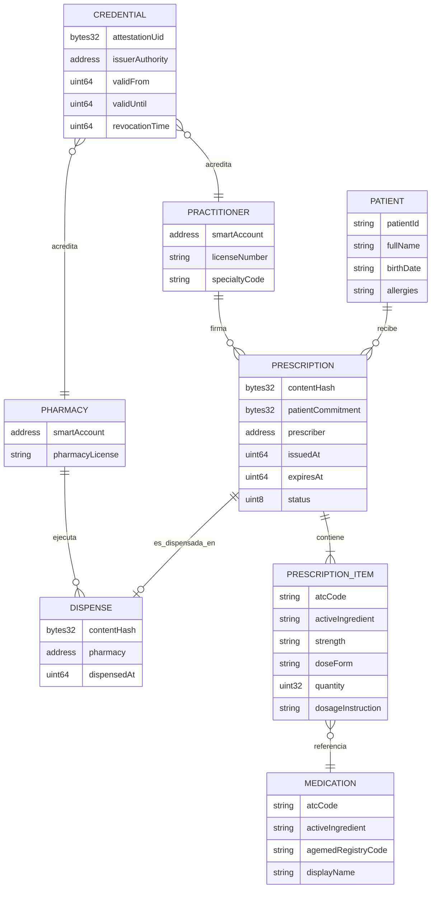

# 03 — Modelo de datos

On-chain se escriben exactamente cuatro cosas: un hash de contenido, un compromiso del paciente con sal única, la dirección del prescriptor y dos marcas de tiempo. Nada más. Todo lo que identifica a una persona o describe su salud vive cifrado fuera de la cadena. Esta es la restricción que gobierna el resto del modelo.

## Regla dura

> **Nunca un identificador de paciente on-chain.**
> Ni el número de cédula, ni un hash del número de cédula, ni un seudónimo estable. Un seudónimo estable permite a cualquier observador de la cadena contar cuántas recetas recibe una persona, con qué frecuencia y en qué farmacias, lo cual es información de salud. Lo que va on-chain es `keccak256(patientId, salt)` con una **sal distinta por receta**, generada aleatoriamente y guardada solo en el almacén cifrado off-chain.

| Consecuencia | Aceptada de forma consciente |
|---|---|
| Nadie puede agrupar las recetas de un paciente mirando la cadena | Sí, es el objetivo |
| Nosotros tampoco podemos hacerlo sin las sales | Sí; la agregación de historial se resuelve off-chain con consentimiento, no on-chain |
| La detección de duplicidad entre farmacias distintas no es posible on-chain en el MVP | Sí, se documenta como límite y como línea de trabajo con pruebas de conocimiento cero |

> **Esta regla cancela la analítica poblacional por paciente.** El informe base ofrecía a gobierno y aseguradoras "supervisar tendencias de salud pública". Con una sal distinta por receta, ninguna consulta sobre la cadena ni sobre nuestro almacén puede responder cuántos pacientes distintos reciben un fármaco, con qué frecuencia repite una persona o cómo evoluciona una cohorte. Eso no vuelve en ninguna fase mientras la regla se mantenga, y la regla se mantiene. Lo que sí queda posible, todo sin identidad de paciente: agregados por prescriptor, por farmacia, por código ATC y por periodo, calculados a partir de eventos on-chain y del registro off-chain. Ver [02](02-roles-y-permisos.md) y [13](13-pitch-y-sostenibilidad.md).

## Entidades



## Dónde vive cada campo

| Campo | On-chain | Off-chain cifrado | Motivo |
|---|---|---|---|
| `contentHash` | ✅ | — | Prueba de integridad; no revela nada |
| `patientCommitment` | ✅ | Sal guardada off-chain | Permite probar la correspondencia sin exponer al paciente |
| `prescriber` (dirección) | ✅ | — | Necesario para verificar credencial y no repudio |
| `issuedAt`, `expiresAt` | ✅ | — | Reglas de vigencia |
| `status` | ✅ | — | Barrera antirreutilización |
| Dirección de la farmacia y `dispensedAt` | ✅ | — | Evidencia de dispensación |
| Nombre, cédula, fecha de nacimiento | ❌ | ✅ | Dato personal |
| Medicamento, dosis, posología | ❌ | ✅ | Revela condición de salud |
| Diagnóstico, alergias, notas | ❌ | ✅ | Dato sensible |
| Sal del compromiso | ❌ | ✅ | Si se filtra, el compromiso deja de proteger |
| Número de matrícula del médico | En la attestation | — | Dato profesional público, no de salud |

### Lista prohibida on-chain

Una revisión de código que encuentre cualquiera de estos campos en un contrato debe bloquear la fusión.

- Nombre, apellidos, fecha de nacimiento, sexo.
- Cédula de identidad, número de historia clínica, número de asegurado.
- Dirección, teléfono, correo electrónico.
- Diagnóstico, código de enfermedad, alergias, antecedentes.
- Nombre o principio activo del medicamento prescrito, dosis, posología.
- Cualquier seudónimo de paciente que se repita entre recetas.

## Codificación de medicamentos

| Nivel | Sistema | Para qué sirve | Para qué **no** sirve |
|---|---|---|---|
| Clasificación terapéutica | ATC | Detectar duplicidad terapéutica y agrupar por grupo farmacológico | No identifica un producto concreto ni una unidad física |
| Principio activo | Denominación común internacional | Prescribir con independencia de la marca | No identifica presentación ni lote |
| Producto registrado | Registro sanitario de AGEMED | Confirmar que el producto está autorizado en Bolivia | No identifica una caja concreta |
| Unidad física | GS1: GTIN + número de serie + lote + caducidad | Rastrear **esta** caja desde el laboratorio | Requiere infraestructura de serialización que no tenemos |

> **Corrección explícita al informe base.**
> El informe base presenta la adopción de códigos ATC como habilitador de la trazabilidad del medicamento desde su fabricación. Es un error. ATC clasifica, GS1 rastrea. Confundirlos lleva a prometer trazabilidad de lote con una herramienta que solo dice a qué familia terapéutica pertenece un fármaco. La trazabilidad de unidades queda en [Fase 3](09-roadmap.md) con [D-21](09-roadmap.md).

> **Decisión pendiente — D-07**
> **Contexto.** Para que la farmacia entregue el producto correcto hace falta un catálogo de medicamentos autorizados en Bolivia. AGEMED mantiene el registro sanitario. `VERIFICAR:` disponibilidad, formato y condiciones de uso de ese registro en forma consultable por máquina.
> **Opciones.** (a) Consumir el registro de AGEMED si existe en formato abierto. (b) Cargar manualmente un subconjunto para el piloto. (c) Prescribir solo por principio activo y ATC, dejando la equivalencia al criterio del farmacéutico.
> **Recomendación.** Opción (c) para el MVP, que además coincide con la buena práctica de prescripción por principio activo, y (b) para el piloto con una lista corta de los medicamentos más frecuentes. La opción (a) depende de un dato que aún no hemos confirmado.
> **Impacto si se difiere.** La receta puede quedar ambigua respecto al producto a dispensar, que es uno de los errores que el sistema dice eliminar.

## El QR

El QR es el único artefacto que el paciente maneja. Debe ser autosuficiente para que la farmacia verifique aunque el paciente no traiga nada más.

```json
{
  "v": 1,
  "chainId": 84532,
  "registry": "<PrescriptionRegistry address>",
  "contentHash": "0x…",
  "pointer": "<opaque off-chain pointer>",
  "key": "<base64url of the DEK; MVP carries it unwrapped, Phase 2 wraps it per recipient (D-24)>"
}
```

| Campo | Función |
|---|---|
| `contentHash` | Lo que la farmacia consulta on-chain |
| `pointer` | Puntero opaco al payload cifrado. No es una URL de IPNS: ver [05](05-almacenamiento-y-cifrado.md) |
| `key` | Material que permite a la farmacia descifrar el documento |

> **Quien tiene el QR puede leer la receta.** Es equivalente a quien tiene el papel hoy, y esa equivalencia es deliberada: el paciente controla el acceso entregando o no entregando el código. El límite es que un QR fotografiado por un tercero sigue siendo legible; por eso el `contentHash` caduca y solo puede dispensarse una vez.

## Estructura del documento cifrado

```json
{
  "schemaVersion": "1.0.0",
  "documentType": "Prescription",
  "createdAt": "2026-09-11T14:02:00Z",
  "encryption": {
    "algorithm": "AES-256-GCM",
    "iv": "<base64>",
    "authTag": "<base64>"
  },
  "signatures": {
    "eip712": {
      "signer": "<prescriber smart account>",
      "value": "<hex>"
    },
    "adsib": {
      "certificateSerial": "<serial>",
      "value": "<base64 PKCS#7 detached signature>",
      "status": "pending-integration"
    }
  },
  "ciphertext": "<base64>"
}
```

El contenido en claro, una vez descifrado:

```json
{
  "patient": { "patientId": "…", "fullName": "…", "birthDate": "…" },
  "salt": "<random per prescription>",
  "practitioner": { "licenseNumber": "…", "fullName": "…" },
  "items": [
    {
      "atcCode": "J01CA04",
      "activeIngredient": "amoxicillin",
      "strength": "500 mg",
      "doseForm": "capsule",
      "quantity": 21,
      "dosageInstruction": "1 capsule every 8 hours for 7 days"
    }
  ],
  "issuedAt": "2026-09-11T14:02:00Z",
  "expiresAt": "2026-10-11T14:02:00Z"
}
```

> La correspondencia se verifica así: la farmacia descifra, calcula `keccak256(patientId, salt)` y comprueba que coincide con el `patientCommitment` on-chain, y calcula el hash del documento cifrado y lo compara con `contentHash`. Si algo no cuadra, la receta no es la que se registró.

## Privacidad de metadatos

> **Decisión pendiente — D-06**
> **Contexto.** Aunque ningún identificador de paciente aparezca on-chain, el grafo de transacciones sigue revelando información: qué médico emite cuánto, qué farmacia dispensa qué volumen y a qué hora. En una cadena pública eso es observable por cualquiera.
> **Opciones.** (a) Aceptar la fuga en el MVP y documentarla. (b) Direcciones seudónimas por receta para el prescriptor, con la credencial demostrada mediante prueba en lugar de mediante la identidad de la dirección. (c) Pruebas de conocimiento cero: probar "el firmante posee una credencial vigente emitida por la autoridad X" sin revelar cuál. (d) Migrar a red permisionada.
> **Recomendación.** Opción (a) para el MVP, declarada abiertamente en el pitch, con (c) como línea de trabajo posterior. La opción (b) es un paso intermedio realista. La opción (d) sacrifica la verificabilidad pública, que es el argumento central del proyecto.
> **Impacto si se difiere.** Ninguno técnico a corto plazo, pero un jurado o un regulador que detecte la fuga y no la vea documentada penalizará el overclaim de privacidad.

## Correspondencia con HL7 FHIR R4

La interoperabilidad no se declara, se compromete con recursos concretos. El MVP no implementa un servidor FHIR; adopta la forma de los recursos para que la migración posterior sea mecánica.

| Entidad interna | Recurso FHIR R4 |
|---|---|
| Patient | `Patient` |
| Practitioner | `Practitioner` + `PractitionerRole` |
| Pharmacy | `Organization` |
| Prescription | `MedicationRequest` |
| PrescriptionItem | `MedicationRequest.medicationCodeableConcept` + `dosageInstruction` |
| Medication | `Medication` con `code` en sistema ATC |
| Dispense | `MedicationDispense` |
| Alergias | `AllergyIntolerance` |

| Estado interno | `MedicationRequest.status` |
|---|---|
| `Issued` | `active` |
| `Dispensed` | `completed` |
| `Expired` | `stopped` |
| `Cancelled` | `cancelled` |

`SUPUESTO:` un `MedicationRequest` describe un único medicamento; una receta con varios ítems se agrupa con `groupIdentifier`. Debe confirmarse contra el perfil que se adopte.

## Siguiente paso

Continuar con [04-smart-contracts.md](04-smart-contracts.md).
