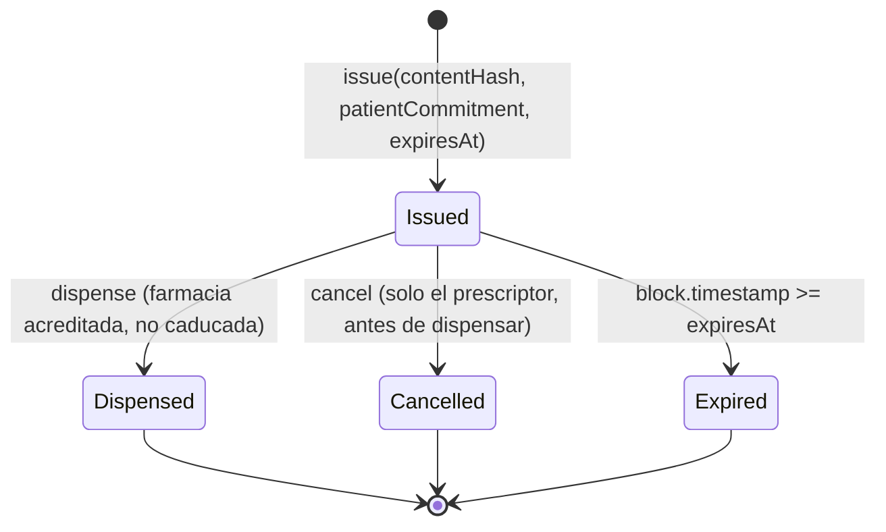
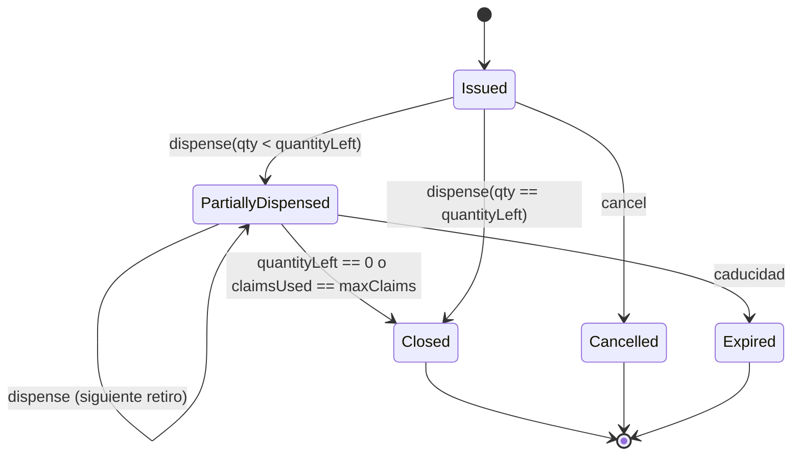

# 04 — Smart contracts

Un solo contrato sostiene la demo: `PrescriptionRegistry`, con dos funciones que caben en una pantalla. `issue` registra el hash de una receta firmada; `dispense` la marca como entregada y revierte si ya lo estaba. Las credenciales profesionales no se guardan aquí: se consultan en EAS. Todo lo que suena a tratamiento crónico, dispensación fraccionada y cantidades parciales queda documentado como extensión y explícitamente fuera del MVP.

## Contratos del MVP

| Contrato | Responsabilidad | ¿Lo escribimos? |
|---|---|---|
| `PrescriptionRegistry` | Ciclo de vida de la receta | Sí |
| `PrescriptionPaymaster` | Patrocinio de gas con política | Sí, mínimo |
| EAS (`SchemaRegistry`, `EAS`) | Credenciales profesionales | No: ya desplegado |
| `EntryPoint` ERC-4337 | Validación y ejecución de `UserOperation` | No: contrato canónico |
| Smart account | Cuenta del profesional con firma P-256 | Preferimos una implementación existente |

## `PrescriptionRegistry`

```solidity
// SPDX-License-Identifier: Apache-2.0
pragma solidity ^0.8.24;

enum PrescriptionStatus { None, Issued, Dispensed, Cancelled }

struct PrescriptionRecord {
    address prescriber;         // smart account of the practitioner
    bytes32 patientCommitment;  // keccak256(patientId, salt) - salt stays off-chain
    uint64  issuedAt;
    uint64  expiresAt;
    address dispensedBy;
    uint64  dispensedAt;
    PrescriptionStatus status;
}

interface IPrescriptionRegistry {
    event PrescriptionIssued(
        bytes32 indexed contentHash,
        address indexed prescriber,
        bytes32 patientCommitment,
        uint64 expiresAt
    );
    event PrescriptionDispensed(
        bytes32 indexed contentHash,
        address indexed pharmacy,
        uint64 dispensedAt
    );
    event PrescriptionCancelled(bytes32 indexed contentHash, address indexed prescriber);

    error AlreadyIssued(bytes32 contentHash);
    error UnknownPrescription(bytes32 contentHash);
    error AlreadyDispensed(bytes32 contentHash, address dispensedBy, uint64 dispensedAt);
    error PrescriptionExpired(bytes32 contentHash, uint64 expiresAt);
    error PrescriptionCancelledError(bytes32 contentHash);
    error NotAccreditedPractitioner(address caller);
    error NotAccreditedPharmacy(address caller);
    error NotPrescriber(address caller, address prescriber);
    error InvalidExpiry(uint64 expiresAt);

    function issue(bytes32 contentHash, bytes32 patientCommitment, uint64 expiresAt) external;

    function dispense(bytes32 contentHash) external;

    function cancel(bytes32 contentHash) external;

    function verify(bytes32 contentHash)
        external
        view
        returns (PrescriptionStatus status, bool dispensable, address prescriber, uint64 expiresAt);

    function getPrescription(bytes32 contentHash) external view returns (PrescriptionRecord memory);
}
```

### El corazón: `dispense`

```solidity
function dispense(bytes32 contentHash) external {
    if (!_isAccreditedPharmacy(msg.sender)) revert NotAccreditedPharmacy(msg.sender);

    PrescriptionRecord storage p = _records[contentHash];

    if (p.status == PrescriptionStatus.None) revert UnknownPrescription(contentHash);
    if (p.status == PrescriptionStatus.Cancelled) revert PrescriptionCancelledError(contentHash);
    if (p.status == PrescriptionStatus.Dispensed) {
        revert AlreadyDispensed(contentHash, p.dispensedBy, p.dispensedAt);
    }
    if (block.timestamp >= p.expiresAt) revert PrescriptionExpired(contentHash, p.expiresAt);

    p.status      = PrescriptionStatus.Dispensed;
    p.dispensedBy = msg.sender;
    p.dispensedAt = uint64(block.timestamp);

    emit PrescriptionDispensed(contentHash, msg.sender, p.dispensedAt);
}
```

> **`AlreadyDispensed` es la demo.** El error personalizado devuelve quién dispensó y cuándo, de modo que la farmacia ve en pantalla "esta receta ya fue entregada en otra farmacia el día X", no un fallo genérico. Ese mensaje es lo que se proyecta en el pitch.

### Verificación de credenciales contra EAS

```solidity
function _isAccreditedPractitioner(address account) internal view returns (bool) {
    bytes32 uid = credentialOf[account];
    if (uid == bytes32(0)) return false;

    Attestation memory a = IEAS(eas).getAttestation(uid);

    return a.schema == practitionerSchema
        && a.recipient == account
        && a.attester == issuerAuthority
        && a.revocationTime == 0
        && (a.expirationTime == 0 || block.timestamp < a.expirationTime);
}
```

| Comprobación | Por qué |
|---|---|
| `a.attester == issuerAuthority` | Cualquiera puede emitir una attestation; solo vale la del emisor autorizado |
| `a.revocationTime == 0` | Una matrícula retirada corta el acceso de inmediato |
| `a.expirationTime` | Las credenciales caducan y deben renovarse |
| `a.recipient == account` | Impide reutilizar la attestation de otro |

### Auto-registro: quién escribe `credentialOf`

`credentialOf[account]` es el puntero que el contrato sigue para encontrar la attestation de una cuenta. Alguien tiene que escribirlo, y esa decisión no puede contradecir [D-14](#d-14), que exige un contrato **sin administrador**. Se resuelve con **auto-registro**:

```solidity
function registerCredential(bytes32 uid) external;
```

Cualquiera puede llamarla, y solo puede escribir su propio puntero. El contrato lee la attestation en EAS **antes** de escribir nada y exige, en el momento del registro, las mismas cinco condiciones que exigirá después en cada uso:

| Comprobación en el registro | Error si falla |
|---|---|
| El uid no es cero y existe en EAS | `InvalidCredentialUid`, `CredentialNotFound` |
| `a.recipient == msg.sender` | `CredentialNotForCaller` |
| `a.attester == issuerAuthority` | `CredentialWrongIssuer` |
| `a.schema` es el de médico o el de farmacia | `CredentialUnknownSchema` |
| `a.revocationTime == 0` | `CredentialRevoked` |
| No caducada | `CredentialExpired` |

Al terminar emite `CredentialRegistered(account, uid, schema)`.

**Por qué esto no introduce un administrador.** El permiso para escribir en `credentialOf` no vale nada: un uid inventado no existe en EAS, uno ajeno falla por `recipient`, y uno firmado por cualquier otra cuenta falla por `attester`. La autoridad real sigue siendo el emisor de credenciales, que actúa en EAS y nunca toca este contrato. Registrar no concede nada: solo declara dónde mirar.

**Por qué se revalida siempre.** Lo que se guarda es un puntero, nunca un veredicto. `_isAccreditedPractitioner` y `_isAccreditedPharmacy` vuelven a leer la attestation en **cada** `issue` y **cada** `dispense`, así que una revocación posterior al registro corta el acceso en la transacción siguiente, sin que nadie tenga que borrar el puntero. Es exactamente la latencia «inmediata» que promete [02](02-roles-y-permisos.md).

**Renovación.** Una credencial renovada es un uid nuevo: se vuelve a llamar `registerCredential` y el puntero se mueve. No hace falta una función de baja ni una de actualización, y no existe ninguna forma de escribir el puntero de otra cuenta.

> En Anvil no hay EAS desplegado, así que `contracts/test/mocks/MockEAS.sol` hace de doble y `script/SetupCredentials.s.sol` acredita las tres cuentas de la demo. Fuera de la cadena 31337, `script/Deploy.s.sol` se niega a desplegar si falta la dirección de EAS, cualquiera de los dos uid de esquema o el emisor autorizado: un registro con esos valores en cero es un contrato cuya acreditación no puede aprobar a nadie, o peor, uno donde una attestation vacía encaja con un esquema vacío.

## Máquina de estados del MVP



`Expired` no es un estado almacenado: es una condición que se evalúa comparando `block.timestamp` con `expiresAt`. No se escribe en storage porque nadie paga gas por declarar caducada una receta que nadie va a usar.

| Estado | ¿Dispensable? | Nota |
|---|---|---|
| `Issued` | Sí, si no ha caducado | Estado inicial |
| `Dispensed` | **Nunca** | Absorbente. No existe función que salga de aquí |
| `Cancelled` | Nunca | Solo el prescriptor, solo antes de dispensar |
| Caducada | Nunca | Condición derivada, no estado |

> **No hay función de reapertura.** Ni administrativa, ni de emergencia, ni con multifirma. Si hubo un error, se emite una receta nueva y el error queda en la cadena. Cualquier propuesta futura de "reabrir" debe rechazarse en revisión.

## La contradicción del informe base, resuelta

El informe base define `quantity_left`, `max_claim` y `Close_transaction`. Son incompatibles tal como están planteados: `quantity_left` y `max_claim` describen una receta que se dispensa en varias veces, mientras que `Close_transaction` cierra la receta en el primer despacho. No se puede tener ambas cosas sin decidir cuál gobierna.

| Variable del informe base | Resolución en el MVP | Resolución en la extensión |
|---|---|---|
| `quantity_left` | Eliminada. La receta es de un solo uso y su cantidad vive off-chain, en el documento cifrado | `quantityLeft` por ítem, decrementado en cada dispensación |
| `max_claim` | Eliminada. Equivale a 1 implícito | `maxClaims` como número de retiros autorizados |
| `expiration_day` | `expiresAt` como timestamp Unix de 64 bits | Igual |
| `status` | `PrescriptionStatus` con cuatro valores | Se añaden `PartiallyDispensed` y `Closed` |
| `New_prescription` | `issue` | Igual, con cantidades |
| `Verify_prescription` | `verify`, función de solo lectura sin coste de gas | Igual |
| `Close_transaction` | `dispense`, que cierra en el mismo acto | `dispense` parcial más cierre automático al agotarse |

### Extensión documentada: tratamiento crónico

Este diseño **no se implementa en el MVP**. Se documenta para que el jurado vea que el problema está entendido y acotado, no ignorado.



| Escenario real | Comportamiento propuesto |
|---|---|
| Receta aguda (antibiótico, 7 días) | `maxClaims = 1`. Es el caso del MVP |
| Tratamiento crónico (hipertensión, 3 meses) | `maxClaims = 3`, un retiro mensual, con intervalo mínimo entre retiros para evitar acaparamiento |
| Dispensación fraccionada por falta de stock | Un solo `maxClaims` pero `quantityLeft` mayor que cero; la farmacia entrega lo que tiene y el resto queda pendiente |
| Cambio de farmacia a mitad del tratamiento | Permitido: el estado está en la cadena, no en la farmacia |

> **Decisión pendiente — D-12**
> **Contexto.** El tratamiento crónico y la dispensación fraccionada son la mitad del volumen real de una farmacia, pero duplican la superficie del contrato y no aportan a una demo de tres minutos.
> **Opciones.** (a) Un solo uso en el MVP, extensión documentada. (b) Implementar cantidades desde el inicio. (c) Modelar la receta crónica como N recetas independientes emitidas de una vez, con fechas de activación escalonadas.
> **Recomendación.** Opción (a) para el buildathon. La opción (c) es interesante porque reutiliza el contrato de un solo uso sin cambiarlo, y merece evaluarse en [Fase 2](09-roadmap.md) antes de añadir contadores.
> **Impacto si se difiere.** Ninguno para la demo. Para un piloto real es bloqueante: una farmacia no puede operar sin recetas crónicas.

## Fuente de tiempo

El contrato usa `block.timestamp` para evaluar la caducidad. Conviene saber qué garantiza y qué no.

| Propiedad | Realidad |
|---|---|
| Precisión | Segundos, pero no es un reloj exacto: lo fija el proponente del bloque |
| Manipulabilidad | Lo fija el validador que propone el bloque y puede desviarlo dentro de un margen acotado. La C-Chain de Avalanche no tiene secuenciador: no hay un único actor que determine el valor, pero tampoco hay una L1 externa que lo arbitre. `VERIFICAR:` la tolerancia exacta de desviación temporal que aceptan los validadores de la C-Chain |
| Monotonía | Creciente entre bloques |
| Riesgo para nosotros | Bajo: una receta con caducidad de treinta días no se ve afectada por una desviación de segundos |

> **Decisión pendiente — D-13**
> **Contexto.** Depender del reloj que fija el validador proponente de la C-Chain para una caducidad con efectos legales merece una decisión explícita, no un descuido.
> **Opciones.** (a) `block.timestamp` con granularidad de días, de modo que cualquier desviación plausible sea irrelevante. (b) Número de bloque como referencia temporal, que es peor porque el tiempo por bloque varía. (c) Oráculo de tiempo, complejidad injustificada. (d) Caducidad evaluada off-chain y solo registrada on-chain.
> **Recomendación.** Opción (a): `expiresAt` se fija a medianoche del día de caducidad y se documenta que la precisión efectiva es de un día. Es suficiente para el dominio y elimina la discusión.
> **Impacto si se difiere.** Ninguno funcional, pero deja un supuesto implícito en un punto con efectos jurídicos.

## Farmacia sin conectividad

> **Decisión pendiente — D-20**
> **Contexto.** Si la farmacia no tiene internet no puede consultar la cadena ni enviar la transacción. Bloquear la venta es inaceptable; permitirla a ciegas rompe la garantía de unicidad, que es la única que ofrecemos.
> **Opciones.** (a) Bloqueo total sin conectividad. (b) Verificación offline de la firma EIP-712 (que prueba autenticidad del emisor pero no unicidad), dispensación provisional y envío de la transacción al recuperar red. (c) Cola de transacciones firmadas por la farmacia, enviadas por un relayer cuando haya red.
> **Recomendación.** Opción (b) combinada con (c), con restricciones: solo medicamentos no controlados, ventana de reconciliación corta y marca explícita de origen offline en el evento. Si al reconciliar la receta ya estaba dispensada, se genera un incidente para revisión humana, no un silencio.
> **Impacto si se difiere.** El MVP demuestra un flujo que no sobrevive al primer corte de internet en una farmacia real de Cochabamba.

## Variante: firma verificada en el momento de dispensar

El MVP registra la receta on-chain cuando el médico la emite. Existe una variante en la que **no se escribe nada hasta la dispensación**: el médico solo firma EIP-712, y la farmacia presenta firma y datos al contrato, que verifica y registra en un solo acto.

| Aspecto | Registro en emisión (MVP) | Verificación diferida |
|---|---|---|
| Transacciones por receta | 2 (emisión y dispensación) | 1 (solo dispensación) |
| Coste total de gas | Mayor | Menor |
| Receta emitida y nunca dispensada | Deja rastro on-chain | No deja rastro: menos metadatos filtrados |
| Complejidad del contrato | Menor | Mayor: verificación EIP-712 en Solidity |
| Legibilidad de la demo | Alta: se ve la emisión | Menor: solo se ve el final |

Se elige el registro en emisión por legibilidad de la demo. La variante diferida es mejor en coste y en privacidad, y debe reconsiderarse para producción.

## Seguridad del contrato

| Riesgo | Mitigación |
|---|---|
| Reentrada | No hay llamadas externas después de mutar el estado; patrón checks-effects-interactions. La única llamada externa es la lectura a EAS, antes de escribir |
| Control de acceso roto | Credencial consultada en EAS en cada llamada, nunca cacheada en storage |
| Colisión de `contentHash` | Es un keccak256 del documento cifrado; una colisión implicaría romper keccak256 |
| Suplantación de emisor de attestation | Se exige `attester == issuerAuthority` |
| Front-running de la dispensación | En el peor caso otra farmacia dispensa antes; es el mismo riesgo que hoy existe con el papel, y queda evidenciado on-chain |
| Denegación por gas | `dispense` es de coste constante; no hay bucles sobre estructuras crecientes |
| Errores personalizados | `error` en lugar de `require` con cadena: menor gas y mensajes accionables en la interfaz |

> **Decisión pendiente — D-14**
> **Contexto.** El contrato del MVP es deliberadamente inmutable y mínimo. Un piloto real necesitará cambios.
> **Opciones.** (a) Inmutable, con despliegue de una versión nueva y migración explícita. (b) Proxy UUPS tras multifirma. (c) Proxy con retardo temporal obligatorio antes de cada actualización.
> **Recomendación.** Opción (a) para el buildathon: un contrato sin administrador es más fácil de auditar y más creíble ante un jurado. Opción (c) si el piloto avanza.
> **Impacto si se difiere.** Ninguno en el MVP, siempre que se acepte redesplegar.

## Pruebas con Foundry

| Prueba | Qué verifica |
|---|---|
| `test_issue_emits_event` | La emisión registra y emite el evento con los campos correctos |
| `test_dispense_marks_dispensed` | Camino feliz completo |
| `test_dispense_twice_reverts` | **La prueba que respalda la demo**: el segundo `dispense` revierte con `AlreadyDispensed` |
| `test_dispense_expired_reverts` | `vm.warp` más allá de `expiresAt` |
| `test_dispense_without_credential_reverts` | Farmacia sin attestation |
| `test_dispense_with_revoked_credential_reverts` | Attestation revocada tras la emisión |
| `test_dispense_with_expired_credential_reverts` | Credencial caducada entre el registro y la entrega |
| `test_dispense_with_credential_of_another_account_reverts` | Attestation dirigida a otra cuenta |
| `test_dispense_with_credential_from_unauthorised_issuer_reverts` | Attestation firmada por un emisor no autorizado |
| `test_registerCredential_*` | Los mismos cinco motivos, rechazados ya en el registro |
| `test_registerCredential_renewal_replaces_the_uid` | La renovación mueve el puntero a un uid nuevo |
| `test_issue_by_non_practitioner_reverts` | Cuenta sin credencial de médico |
| `test_cancel_only_by_prescriber` | Otro médico no puede anular |
| `test_cancel_after_dispense_reverts` | No se anula lo ya entregado |
| `testFuzz_never_leaves_dispensed` | Fuzz acotado, 256 pasadas: con un llamante y un salto temporal cualesquiera, `dispense` seguido de `cancel` no saca la receta de `Dispensed`. **No es un `invariant_` de Foundry**, no fuzzea la secuencia y el salto (`uint16`, 18,2 h) no alcanza la caducidad de 30 días |

## Siguiente paso

Continuar con [05-almacenamiento-y-cifrado.md](05-almacenamiento-y-cifrado.md).
