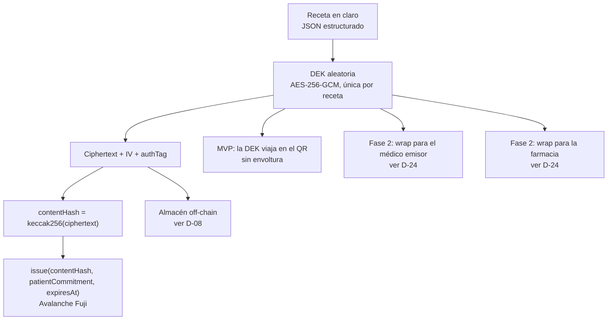
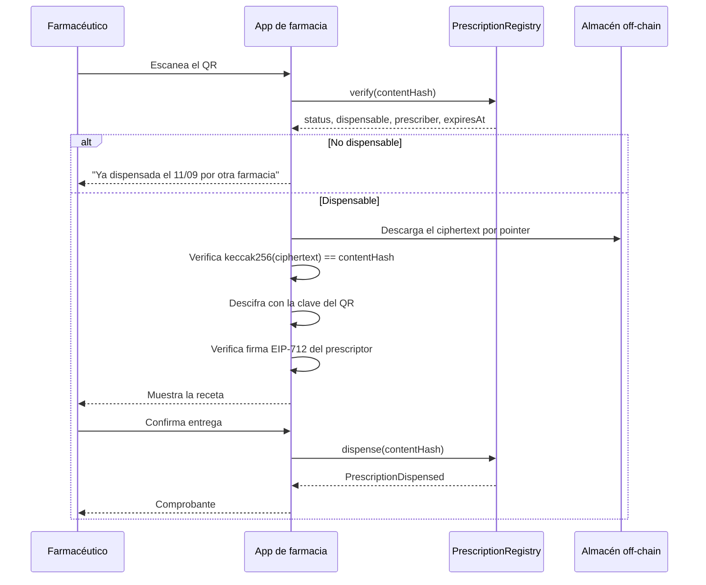
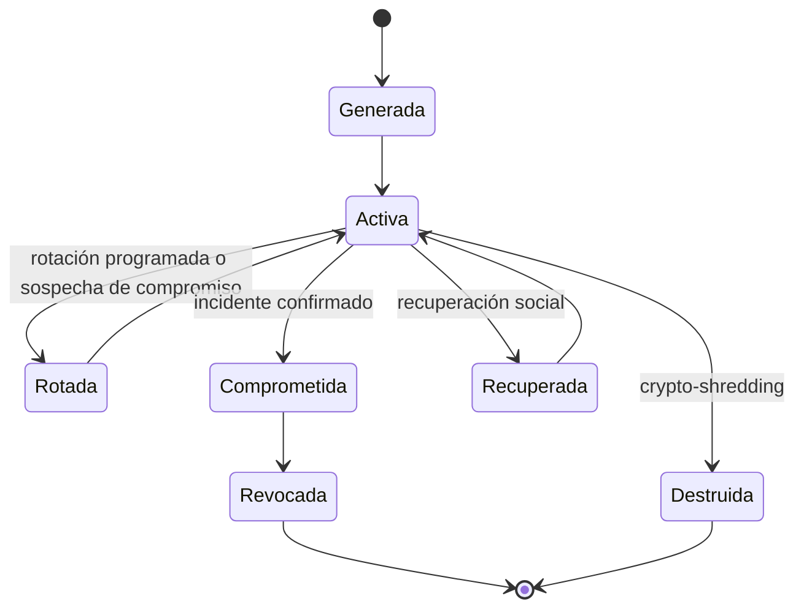

# 05 — Almacenamiento y cifrado

La receta se cifra una sola vez con una clave simétrica propia del documento (la DEK), y esa clave se envuelve por separado para cada destinatario. Esto reemplaza la formulación del informe base —"el reporte se cifra con la clave del paciente"— que no permite que la farmacia lea la receta sin entregarle la clave del paciente. Para el MVP, **dónde** se guarda el ciphertext es indiferente: Postgres o IPFS dan lo mismo.

## Dónde se guarda el payload

> **Para el MVP, Postgres e IPFS son intercambiables.**
> Lo que hace verificable el sistema es el hash on-chain, no el sistema de archivos. Si el ciphertext se altera, el hash deja de coincidir y la farmacia lo detecta, esté donde esté guardado. Decir "usamos IPFS" no añade seguridad por sí solo, y en tres días añade una dependencia operativa que puede fallar en la demo.

| Opción | A favor | En contra |
|---|---|---|
| **Postgres** | Cero configuración, latencia predecible, control total de retención y borrado | Custodia centralizada en el operador |
| **IPFS (Kubo)** | Direccionamiento por contenido, replicación entre participantes | Requiere pinning; sin él el contenido se pierde. Latencia variable |
| Almacenamiento de objetos | Barato y simple | Igual que Postgres en cuanto a custodia |

> **IPNS queda fuera del MVP.** Es lento e inestable para un flujo de mostrador. Si se necesita un puntero mutable, el puntero vive on-chain o en el índice off-chain, no en IPNS.

> **Decisión pendiente — D-08**
> **Contexto.** Hay que elegir dónde reside el ciphertext, y la elección tiene consecuencias distintas para la demo y para producción.
> **Opciones.** (a) Postgres para el MVP y decidir después. (b) IPFS desde el inicio con pinning propio. (c) Modelo doble: Postgres como fuente operativa e IPFS como réplica verificable.
> **Recomendación.** Opción (a). El puntero del QR es opaco, de modo que cambiar el backend después no rompe el formato del código ni el contrato. La opción (c) es el destino probable cuando haya varias instituciones que no confíen entre sí.
> **Impacto si se difiere.** Se pierde tiempo de buildathon montando infraestructura que la demo no necesita.

### Si se elige IPFS

> **Advertencia dura: un CID no es almacenamiento.**
> Un CID es un nombre derivado del contenido. Si ningún nodo tiene el bloque fijado (pinned), el recolector de basura lo elimina y el documento deja de ser recuperable. Cualquier afirmación del tipo "se guarda en IPFS" que no venga acompañada de una política de pinning describe un sistema que pierde datos clínicos.

> **Decisión pendiente — D-10**
> **Contexto.** La persistencia depende por completo de una política de pinning que el informe base no menciona.
> **Opciones.** (a) Pinning replicado en nodos de las instituciones participantes, con factor mínimo de 3. (b) Servicio de pinning gestionado por un proveedor externo. (c) No usar IPFS.
> **Recomendación.** Opción (c) para el MVP, coherente con D-08. Si más adelante se adopta IPFS, opción (a) con factor mínimo de 3 en organizaciones distintas, copia fría fuera de la red y verificación periódica de recuperabilidad por CID.
> **Impacto si se difiere.** Pérdida irreversible de documentos clínicos, que es un riesgo para el paciente, no solo de ingeniería.

| Regla de retención propuesta | Valor |
|---|---|
| Factor de replicación | Mínimo 3 nodos en organizaciones distintas |
| Copia fría | Al menos una, del mismo payload cifrado |
| Verificación de disponibilidad | Comprobación periódica por CID con alerta ante fallo |
| Periodo de conservación | `VERIFICAR:` obligación boliviana de conservación de historia clínica. Lo fija asesoría legal, no ingeniería |
| Fin de retención | Destrucción de la DEK más despinning en todos los nodos |

## Esquema criptográfico



| Elemento | Algoritmo | Motivo |
|---|---|---|
| Cifrado del documento | AES-256-GCM | Cifrado autenticado: detecta manipulación del ciphertext |
| Envoltura de la DEK | Fase 2: HPKE (RFC 9180) con un par de claves de cifrado dedicado por destinatario. Ver [D-24](#d-24) | Permite entregar la misma DEK a varios destinatarios sin recifrar |
| Firma del médico | EIP-712 con la smart account (P-256 vía passkey) | Legible por el firmante, verificable on-chain |
| Firma legal | PKCS#7 con certificado ADSIB (X.509/RSA) | Validez jurídica en Bolivia. Ver [07](07-seguridad-y-cumplimiento.md) |
| Hash | keccak256 | El que usa el EVM |

> **La DEK del MVP viaja en el QR.** Es simple y funciona: quien tiene el QR puede leer la receta, igual que quien tiene el papel hoy. Cuando el paciente tenga cuenta propia ([Fase 2](09-roadmap.md)), la DEK se envuelve para su clave y el QR deja de contenerla.

<a id="d-24"></a>

> **Decisión pendiente — D-24: par de claves de cifrado, separado de la passkey**
>
> **Contexto.** Una passkey WebAuthn es una clave P-256 de *firma* (ECDSA): el autenticador expone assertions, no acuerdo de claves. No se puede hacer ECDH con ella, y tampoco existe un secp256k1 del médico, porque el diseño lo elimina a propósito (`El médico no tiene una cuenta externa con clave privada`, ver [01](01-arquitectura.md)). Envolver la DEK para el médico o la farmacia exige, por lo tanto, material criptográfico que hoy el diseño no tiene.
>
> **Opciones.** (a) Par de cifrado dedicado por profesional, derivado en el cliente y respaldado por el mismo mecanismo de recuperación de D-04. (b) Servicio de envoltura del lado del servidor, que reintroduce un custodio y contradice el modelo de confianza. (c) Mantener indefinidamente la DEK en el QR, que impide compartir la receta con un tercero que no lo haya escaneado.
>
> **Recomendación.** Opción (a), con HPKE sobre P-256 y el par de cifrado explícitamente distinto de la passkey. Nunca reutilizar una clave de firma para acuerdo de claves: es un anti-patrón de uso cruzado de protocolo.
>
> **Impacto si se difiere.** Ninguno en el MVP, porque la DEK viaja en el QR. Bloquea toda la Fase 2: sin esto no hay acceso del paciente desde su propia cuenta ni entrega selectiva a una farmacia.

## Secuencia: emitir

```mermaid
sequenceDiagram
    participant M as Médico
    participant App as App del médico
    participant R as Motor de reglas
    participant API as API
    participant St as Almacén off-chain
    participant PR as PrescriptionRegistry

    M->>App: Completa la receta
    App->>R: Verificación determinística
    R-->>App: Alertas (alergia, duplicidad ATC)
    M->>App: Acepta o desestima cada alerta
    App->>App: Genera salt y DEK; cifra (AES-256-GCM)
    App->>App: contentHash = keccak256(ciphertext)
    App->>App: patientCommitment = keccak256(patientId, salt)
    M->>App: Firma EIP-712 con passkey
    App->>API: Envía ciphertext y firma
    API->>St: Guarda ciphertext y salt
    API->>PR: issue(contentHash, patientCommitment, expiresAt) vía paymaster
    PR-->>API: PrescriptionIssued
    API-->>App: QR con contentHash, pointer y clave
    App-->>M: Muestra el QR para el paciente
```

## Secuencia: dispensar



## Revocación de acceso

> **Revocar no borra lo ya descargado.**
> Retirar la clave envuelta de un destinatario impide que descifre documentos a partir de ese momento. No hace nada respecto a lo que ya descargó y descifró. Ni este sistema ni ningún otro puede deshacer eso. La afirmación correcta es "revocamos el acceso futuro", y así debe figurar en el aviso que el paciente acepta. Presentar la revocación como borrado retroactivo es una afirmación falsa con consecuencias legales.

| Acción | Efecto real |
|---|---|
| Retirar la clave envuelta de un destinatario | No puede descifrar a partir de ahora |
| Borrar el ciphertext del almacén | Nadie más lo descarga; quien ya lo tenía lo conserva |
| Destruir la DEK | El ciphertext deja de ser descifrable por nadie, incluido el paciente |
| Cambiar el estado on-chain | No afecta al acceso al contenido; afecta a la dispensabilidad |

## Ciclo de vida de las claves



> **Decisión pendiente — D-09**
> **Contexto.** En el MVP el paciente no tiene clave: la DEK viaja en el QR. Cuando el paciente tenga cuenta propia, perder la clave significa perder el historial, y un sistema de salud no puede tener esa propiedad.
> **Opciones.** (a) Custodia por el operador: recuperación trivial, soberanía nula. (b) Recuperación social con guardianes, umbral de M de N. (c) Fragmentación del secreto entre varios servicios con umbral. (d) Sin recuperación.
> **Recomendación.** Opción (b) como predeterminada, con (a) disponible como elección explícita del paciente que no quiera gestionar nada. La opción (d) es inaceptable: un paciente mayor que pierde el teléfono no puede perder su medicación.
> **Impacto si se difiere.** Ninguno en el MVP. Bloquea la [Fase 2](09-roadmap.md).

## Crypto-shredding

Es la única respuesta técnica viable a una solicitud de supresión cuando el dato ya se distribuyó y el anclaje es inmutable.

| Paso | Acción |
|---|---|
| 1 | Verificar si existe obligación legal de conservación que prevalezca. Ver [07](07-seguridad-y-cumplimiento.md) |
| 2 | Destruir la DEK y todas sus envolturas |
| 3 | Borrar o despinnear el ciphertext donde sea posible |
| 4 | Dejar constancia de la supresión sin escribir datos personales |
| 5 | Entregar al solicitante un certificado que declare también los límites del procedimiento |

### Por qué el cifrado hace defendible el modelo

1. On-chain solo hay un hash, un compromiso con sal y dos direcciones. Nada de eso identifica a un paciente.
2. El contenido vive únicamente en el ciphertext. Destruida la DEK, ese ciphertext es indistinguible de ruido con el conocimiento criptográfico actual.
3. Por tanto, la supresión efectiva se consigue destruyendo la clave, no persiguiendo copias del ciphertext.

> **Los límites, dichos con todas las letras.** Crypto-shredding es la mitigación estándar, no una garantía. Descansa en tres supuestos no demostrables: que la DEK se destruyó en todas sus copias, que ningún destinatario conservó el documento ya descifrado, y que AES-256 no se rompe en el futuro. Lo que sí es demostrable es que el modelo es sustancialmente mejor que almacenar en claro. Esa es la afirmación que el proyecto puede sostener.

> **Decisión pendiente — D-11**
> **Contexto.** `VERIFICAR:` hasta donde hemos podido establecer, Bolivia no cuenta con una ley general de protección de datos personales que reconozca un derecho de supresión equivalente al europeo. Eso no elimina la obligación ética ni el posible amparo constitucional de la privacidad.
> **Opciones.** (a) Aplicar crypto-shredding por diseño, con independencia de que la ley lo exija. (b) Esperar a que exista obligación legal. (c) Alinearse voluntariamente con un estándar internacional como referencia de buena práctica.
> **Recomendación.** Combinar (a) y (c): implementar la capacidad técnica y declarar públicamente el estándar que se adopta voluntariamente. Es una ventaja competitiva y una posición defendible si la legislación cambia.
> **Impacto si se difiere.** El sistema no puede responder a una solicitud de supresión y depende de que nadie la presente.

## Siguiente paso

Continuar con [06-validacion-clinica.md](06-validacion-clinica.md).
