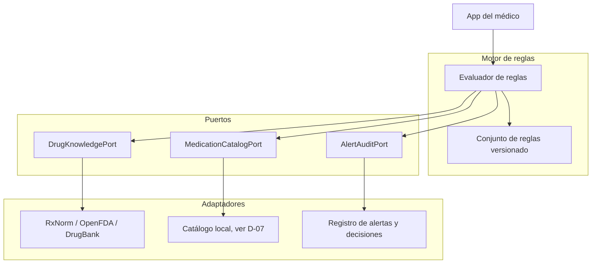
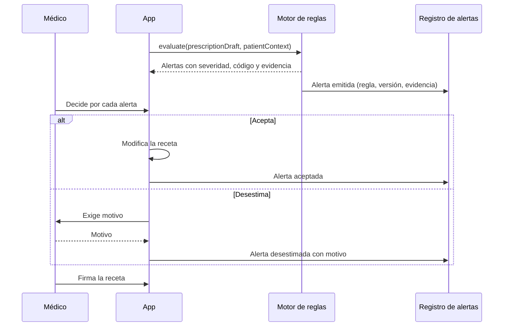

# 06 — Validación clínica

Esto no es inteligencia artificial. Es un motor de reglas determinístico que cruza el medicamento prescrito contra las alergias y la medicación concomitante que el médico declara en el formulario de la receta, usando bases de datos farmacológicas abiertas. No consulta ningún historial del paciente, porque no existe uno al que pueda acceder: ver [D-25](#d-25). Damos la misma respuesta ante la misma entrada, siempre, y podemos explicar por qué. Llamarlo IA sería inflar la descripción de un cruce de tablas.

## Autocrítica explícita

> **El informe base lo llamaba "capa de IA". Nosotros lo llamamos motor de reglas, y esa corrección es deliberada.**
> Un cruce entre una lista de fármacos prescritos y una tabla de interacciones conocidas es una consulta, no un modelo. Presentarlo como inteligencia artificial ante un jurado técnico resta credibilidad: la primera pregunta será "¿qué modelo, entrenado con qué datos?" y no hay respuesta. Un motor determinístico es más defendible, más auditable y, en un dominio donde un falso negativo puede dañar a un paciente, clínicamente preferible.

| Lo que el informe base proponía | Lo que hacemos | Motivo |
|---|---|---|
| "Capa de IA" para validación clínica | Motor de reglas determinístico | Es lo que realmente es |
| Visión por computador y NLP para leer recetas | **Eliminado del MVP** | Es contradictorio aplicar OCR a recetas que el propio sistema emite en formato digital estructurado |
| "Auditoría en tiempo real" de anomalías | Reglas con umbrales explícitos | Una anomalía sin definición no es detectable |
| Detección de doctor shopping | Fuera del MVP | Requiere correlacionar recetas del mismo paciente, lo que nuestro modelo de privacidad impide por diseño. Ver [03](03-modelo-de-datos.md) |
| Cruce de la receta "con el historial en la blockchain" | Cruce con lo que el médico declara en la receta | No hay historial on-chain: es consecuencia directa de la regla dura de [03](03-modelo-de-datos.md). Ver [D-25](#d-25) |

## Qué hace el motor

| Regla | Entrada | Salida | En el MVP |
|---|---|---|---|
| Alergia declarada | Alergias declaradas por el médico en la receta + principio activo prescrito | Coincidencia exacta o por grupo | ✅ |
| Duplicidad terapéutica | Códigos ATC de lo prescrito | Dos ítems del mismo subgrupo ATC | ✅ |
| Interacción fármaco-fármaco | Pares de principios activos, entre los prescritos y con la medicación concomitante declarada | Par conocido con nivel de gravedad | ⚠️ según [D-15](#d-15) |
| Dosis fuera de rango | Dosis, frecuencia, edad | Desviación respecto al rango de referencia | ❌ Fase 2 |
| Contraindicación por condición | Diagnóstico + fármaco | Contraindicación registrada | ❌ Fase 2 |

### Ejemplo de regla determinística

```
rule DuplicateTherapy:
  for each pair (itemA, itemB) in prescription.items:
    if atcLevel4(itemA.atcCode) == atcLevel4(itemB.atcCode):
      raise Alert(
        severity = MODERATE,
        code     = "DUPLICATE_THERAPY",
        evidence = [itemA.atcCode, itemB.atcCode]
      )
```

No hay umbral aprendido, no hay probabilidad y no hay caja negra. La alerta cita la evidencia que la produjo.

## De dónde sale el contexto del paciente

Todo lo que el motor sabe del paciente lo escribe el médico en el formulario de la receta en el momento de prescribir. No hay historial que consultar: el modelo de datos prohíbe cualquier identificador de paciente on-chain y, en consecuencia, ni siquiera nosotros podemos agrupar las recetas de una misma persona ([03](03-modelo-de-datos.md)). El informe base resolvía este punto con "el historial agregado en la blockchain"; esa solución desapareció con la decisión de privacidad y este apartado fija la que la reemplaza.

| Campo de `patientContext` | Quién lo aporta en el MVP | Procedencia |
|---|---|---|
| `declaredAllergies` | El médico, en el formulario | Lo que el paciente le refiere en la consulta |
| `concomitantMedication` | El médico, en el formulario | Lo que el paciente le refiere en la consulta |
| `age`, `weight` | El médico, en el formulario | Necesarios para dosis fuera de rango; no se capturan en el MVP (Fase 2) |
| Historial de recetas previas | Nadie | No existe en el MVP. Ver [D-25](#d-25) |

> **Consecuencia clínica.** El motor no detecta nada que el médico no sepa o no declare. Una alergia que el paciente olvida mencionar o una medicación prescrita por otro profesional y no referida quedan fuera del alcance de cualquier alerta. Es el mismo límite que tiene hoy la consulta presencial, ni mayor ni menor, y se declara así en la interfaz y en el pitch.

<a id="d-25"></a>

> **Decisión pendiente — D-25: procedencia del contexto clínico del paciente**
>
> **Contexto.** El motor invoca `evaluate(prescriptionDraft, patientContext)` y cruza alergias y medicación concomitante. La regla dura de [03](03-modelo-de-datos.md) prohíbe cualquier identificador de paciente on-chain y usa una sal distinta por receta, de modo que no se pueden agrupar las recetas de una persona ni construir un historial a partir de la cadena. El hueco no es un olvido: es consecuencia directa de la decisión de privacidad, que se prefirió a la agregación de historial de forma deliberada ([01](01-arquitectura.md), [D-06](03-modelo-de-datos.md)). Hace falta decir, entonces, de dónde sale el contexto que el motor evalúa.
>
> **Opciones.** (a) El médico declara alergias y medicación concomitante en el formulario de la receta, en ese momento y sin historial. Es lo único construible en el MVP. (b) Historial off-chain del propio establecimiento de salud, bajo su custodia y alcanzado por el consentimiento del paciente: la clínica que ya atiende al paciente aporta el contexto que ya tiene, sin cruzar datos entre instituciones. Fase 2. (c) Historial portable del paciente en su propia cuenta, que él mismo presenta al médico y cuyo acceso controla. Fase 3, porque exige la cuenta y la clave del paciente ([D-09](05-almacenamiento-y-cifrado.md), [D-24](05-almacenamiento-y-cifrado.md)).
>
> **Recomendación.** Opción (a) para el MVP, declarada sin ambigüedad en la interfaz, en la demo y en el pitch: el contexto es lo que el médico escribe. La opción (b) es el siguiente paso natural y no reintroduce ningún dato on-chain. La opción (c) es la única que devuelve al paciente el control que el informe base prometía, y es la más lejana.
>
> **Impacto si se difiere.** El motor valida solo contra lo que el médico declara en ese momento y no detecta nada que el médico no sepa o no declare. Si esto no se dice, la primera pregunta del jurado ("¿contra qué cruzan la alergia?") descubre un hueco que en realidad es una decisión; ver [12](12-preguntas-de-jurado.md).

## Fuentes de conocimiento

| Fuente | Qué aporta | Condiciones |
|---|---|---|
| **RxNorm** | Normalización de nombres de fármacos y relaciones entre ellos | Abierta. `VERIFICAR:` cobertura de medicamentos comercializados en Bolivia |
| **OpenFDA** | Etiquetado, eventos adversos, advertencias | Abierta. Orientada al mercado estadounidense |
| **DrugBank** | Interacciones fármaco-fármaco con gravedad | Versión académica abierta, uso comercial bajo licencia |
| Clasificación ATC | Agrupación terapéutica | Publicada por la Organización Mundial de la Salud |
| Registro sanitario de AGEMED | Qué está autorizado en Bolivia | Ver [D-07](03-modelo-de-datos.md) |

<a id="d-15"></a>

> **Decisión pendiente — D-15**
> **Contexto.** La detección de interacciones exige una base de datos mantenida. Las fuentes abiertas cubren bien el mercado estadounidense y de forma desigual el boliviano; las comerciales exigen licencia.
> **Opciones.** (a) Licenciar una base comercial de interacciones. (b) Usar RxNorm, OpenFDA y la versión abierta de DrugBank, asumiendo cobertura incompleta. (c) Limitar el MVP a alergias declaradas y duplicidad ATC, que no necesitan base de interacciones externa.
> **Recomendación.** Opción (c) para el buildathon y (b) para el piloto, declarando la cobertura real. Pasar a (a) solo cuando haya uso clínico verdadero. Lo que **no** se debe hacer es presentar cobertura completa de interacciones apoyándose en fuentes que no la tienen para Bolivia: un falso negativo silencioso es el peor error posible en este dominio.
> **Impacto si se difiere.** Se promete una capacidad clínica que el sistema no tiene.

## Arquitectura



| Regla arquitectónica | Motivo |
|---|---|
| El motor solo lee | Un fallo de la regla no puede alterar una receta |
| Las reglas están versionadas | Toda alerta registra qué versión la produjo |
| Nunca bloquea la emisión | El médico puede desestimar cualquier alerta con motivo |
| No escribe en la cadena | La validación clínica es off-chain por completo |

## Supervisión humana

Toda alerta genera dos registros: la alerta y lo que el médico hizo con ella.



> `patientContext` contiene únicamente lo que el médico declaró en el formulario: alergias y medicación concomitante. No hay consulta a ningún historial. Ver [D-25](#d-25).

> El registro de alertas vive off-chain junto al documento cifrado, porque contiene qué fármacos y qué alergias estaban en juego. On-chain no va nada de esto.

## Severidad y fatiga de alertas

La fatiga de alertas es un riesgo clínico real: un sistema que alerta demasiado entrena al médico a descartar sin leer, incluida la alerta que importaba.

| Nivel | Criterio | Comportamiento |
|---|---|---|
| Crítica | Alergia declarada en la receta que coincide con el principio activo | Bloqueo modal; exige motivo escrito |
| Alta | Interacción de gravedad mayor | Bloqueo modal; exige seleccionar motivo |
| Moderada | Duplicidad terapéutica | Aviso en línea, no interrumpe |
| Informativa | Observación de contexto | Panel lateral |

| Táctica | Descripción |
|---|---|
| Supresión de repetición | Una alerta desestimada no se repite para la misma combinación dentro de una ventana |
| Solo lo crítico interrumpe | Los niveles moderado e informativo nunca bloquean |
| Medición | La tasa de desestimación por regla es el indicador de salud del motor |
| Retirada de reglas ruidosas | Una regla con desestimación sostenidamente alta se degrada o se retira |

> **Decisión pendiente — D-16**
> **Contexto.** El umbral de sensibilidad equilibra falsos negativos (riesgo clínico directo) contra falsos positivos (fatiga, que produce riesgo clínico indirecto). No hay un valor universalmente correcto.
> **Opciones.** (a) Máxima sensibilidad. (b) Umbral por tipo de alerta, acordado con médicos del piloto. (c) Umbral adaptativo por médico según su comportamiento previo.
> **Recomendación.** Opción (b). La opción (a) garantiza fatiga; la (c) es peligrosa, porque un médico que desestima sistemáticamente recibiría menos alertas justo por eso.
> **Impacto si se difiere.** El motor se despliega con umbrales arbitrarios y se evalúa con criterios que nadie acordó.

## Métricas

Ninguna tiene valor de referencia todavía. Se fijan con los médicos del piloto.

| Métrica | Definición |
|---|---|
| Tasa de desestimación por regla | Alertas desestimadas sobre emitidas. Indicador directo de ruido |
| Cobertura de codificación | Recetas con ATC resuelto. Sin ATC no hay análisis |
| Latencia de evaluación | Tiempo de respuesta. `SUPUESTO:` por debajo de 1 s para no interrumpir el flujo |
| Alertas por receta | Media. Si sube demasiado, la fatiga es inevitable |

> **No hay benchmarks.** El informe base no aporta métricas de rendimiento y este documento no las inventa.

## Si algún día entra un modelo de lenguaje

No hay ninguno en el MVP. Si se incorporara, estas condiciones son obligatorias antes de cualquier uso clínico.

| Requisito | Regla |
|---|---|
| Declaración explícita | Nombre del modelo, versión y proveedor, visibles en la interfaz |
| Dónde corre | Preferentemente autoalojado. Si es una API externa, debe declararse cuál |
| Datos del paciente | **Nunca** se envían datos identificables ni contenido clínico a una API externa sin base legal y consentimiento explícito |
| Alcance | Nunca sobre la decisión terapéutica. Como máximo, redacción de indicaciones para el paciente o resumen de texto ya visible para el médico |
| Alucinaciones | Toda salida se presenta como borrador editable, nunca como dato |
| Trazabilidad | Prompt, versión del modelo y salida quedan registrados |
| Regulación | Un modelo que sugiere dosis o interacciones probablemente califica como producto sanitario y exige dictamen regulatorio previo |

## Siguiente paso

Continuar con [07-seguridad-y-cumplimiento.md](07-seguridad-y-cumplimiento.md).
