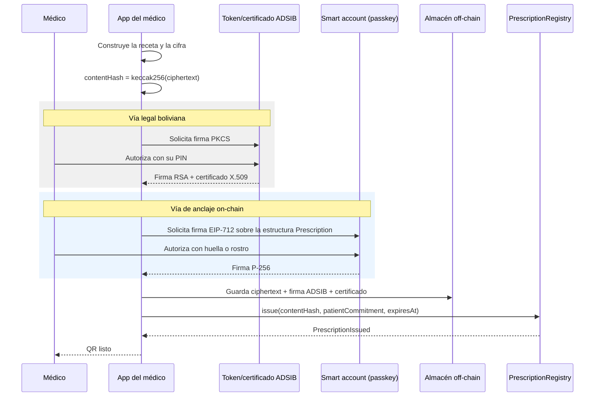

# 07 — Seguridad y cumplimiento

Este documento hace dos cosas que suelen evitarse. Primero, dice qué ataques **no** resuelve el sistema: la cadena no impide que un médico corrupto emita recetas perfectamente válidas, ni la colusión entre un médico y una farmacia, ni que alguien robe el dispositivo del médico. Segundo, aborda el problema técnico central del despliegue en Bolivia: un certificado ADSIB es X.509 sobre RSA y una firma de Ethereum es secp256k1. Son incompatibles, y la solución es firmar dos veces.

## Modelo de amenazas con honestidad

| Ataque | Mitigación | NO MITIGADO |
|---|---|---|
| Receta falsificada por alguien sin matrícula | El contrato exige attestation vigente del emisor autorizado | Nada: este caso sí queda cubierto |
| Reutilización de la misma receta en varias farmacias | `dispense` revierte en el segundo intento | Si la farmacia entrega el medicamento sin registrar la dispensación, el contrato no se entera |
| **Médico corrupto que emite recetas válidas** | Cada receta queda registrada con su dirección y es auditable después | **La blockchain no lo impide.** Un médico con matrícula vigente puede emitir todas las recetas que quiera. Solo mejora la detección posterior por patrón |
| **Colusión médico-farmacia** | Ambas partes quedan registradas y el patrón es visible | **No se previene.** Si ambos actores acreditados cooperan, el sistema registra fielmente un fraude |
| **Robo de la clave del médico** | Passkey en enclave seguro, recuperación social, revocación de credencial | **Entre el robo y la revocación, el atacante emite recetas válidas.** Ninguna criptografía resuelve una clave robada |
| Alteración del contenido de la receta | `contentHash` on-chain; cualquier cambio lo detecta la farmacia | Nada |
| Suplantación de la farmacia | Attestation `PharmacyCredential` verificada en cada dispensación | Una farmacia acreditada que presta su cuenta a un tercero |
| Emisor de credenciales comprometido | Multifirma; las attestations son públicas y auditables | Un emisor comprometido puede acreditar a un impostor. Es el punto único de confianza restante |
| Fuga del almacén off-chain | Todo está cifrado con AES-256-GCM; las claves no están en el mismo almacén | Si se filtran ciphertext y claves a la vez, el contenido queda expuesto |
| Correlación por metadatos on-chain | Compromiso con sal única por receta; ningún identificador de paciente | **El grafo de transacciones sigue siendo público.** Ver [03, D-06](03-modelo-de-datos.md) |
| QR fotografiado por un tercero | Un solo uso más caducidad | Quien fotografía el QR puede leer la receta y, si llega antes a una farmacia, dispensarla |
| Censura o caída del secuenciador del L2 | Los L2 ofrecen vías de inclusión forzada desde L1 | Durante una caída, las farmacias no pueden dispensar en línea. Ver [D-20](04-smart-contracts.md) |
| Error en el contrato | Superficie mínima, pruebas con Foundry, contrato inmutable | Sin auditoría externa, un fallo no detectado sigue siendo posible |

> **Lo que la blockchain resuelve es la verificabilidad, no la honestidad.** Garantiza que una receta no se use dos veces y que su emisor sea quien dice ser. No convierte a un profesional deshonesto en honesto. Cualquier presentación que sugiera lo contrario es overclaim.

## STRIDE sobre el flujo de receta

| Categoría | Amenaza concreta | Control |
|---|---|---|
| Spoofing | Cuenta que se hace pasar por médico | Attestation EAS del emisor autorizado |
| Tampering | Modificación del ciphertext en el almacén | `contentHash` on-chain y AES-GCM |
| Repudio | El médico niega haber emitido | Firma EIP-712 más, cuando aplique, firma ADSIB |
| Information disclosure | Lectura del contenido clínico | Cifrado y ningún dato personal on-chain |
| Denial of service | Saturación del paymaster | Límites por cuenta y por ventana de tiempo |
| Elevation of privilege | Una farmacia intentando emitir | Esquemas de credencial separados y verificados por función |

## Marco legal boliviano

> **Advertencia general.** Lo que sigue es un mapa preliminar elaborado a partir de la fuente del proyecto y de conocimiento general. No sustituye asesoría legal boliviana. Ninguna afirmación aquí debe usarse en una presentación pública sin verificación previa, y no se citan números de artículo salvo donde la referencia es inequívoca.

| Norma | Ámbito | Relevancia para el proyecto |
|---|---|---|
| **Ley 1737 del Medicamento** | Régimen del medicamento en Bolivia | Marco de la prescripción y de los productos autorizados. `VERIFICAR:` requisitos formales que la norma impone a la receta |
| **AGEMED** | Agencia estatal de medicamentos y tecnologías en salud | Registro sanitario de medicamentos autorizados. Es la fuente natural del catálogo. Ver [D-07](03-modelo-de-datos.md) |
| **Ley 913** | Lucha contra el tráfico ilícito de sustancias controladas | Define el régimen de sustancias controladas y su prescripción. Ver [D-18](#d-18) |
| **Ley 164** | Ley General de Telecomunicaciones y TIC | Reconoce la firma digital y el documento digital |
| **DS 1793** | Reglamento de la Ley 164 | Desarrolla el régimen de certificados y firma digital |
| **ADSIB** | Agencia para el Desarrollo de la Sociedad de la Información en Bolivia | Autoridad de certificación estatal. Emite los certificados de firma digital |
| **Ley 1080** | Ciudadanía Digital | Identidad digital del ciudadano para trámites con el Estado. Vía potencial de identificación de médicos y pacientes |
| **Ley 1152** | Hacia el Sistema Único de Salud | Marco del SUS. Define el contexto institucional del piloto |
| **SNIS** | Sistema Nacional de Información en Salud | Destino natural de la interoperabilidad con el sector público |
| **Constitución Política del Estado, artículo 130** | Acción de protección de privacidad | Vía constitucional de tutela de datos personales |

> **Eliminado deliberadamente.** El informe base menciona un "Plan Nacional de Salud 2026-2030". No hemos podido verificar esa referencia y no aparece en esta documentación. Citar un plan sin fuente ante un jurado o un funcionario es un riesgo innecesario.

### El hueco regulatorio

> **`VERIFICAR:` hasta donde hemos podido establecer, Bolivia no cuenta con una ley general de protección de datos personales.**
> La tutela existe por vía constitucional, mediante la acción de protección de privacidad del artículo 130 de la CPE, y por normas sectoriales, pero no hay un régimen general equivalente al RGPD europeo con principios de minimización, base legal del tratamiento, derechos de acceso y supresión y una autoridad de control.
>
> Esto es un hallazgo, no una conclusión: debe confirmarlo asesoría legal boliviana antes de afirmarlo en público.
>
> **Por qué decirlo suma.** La ausencia de obligación legal no es una licencia para tratar datos de salud sin cuidado. Declarar que adoptamos voluntariamente estándares de minimización, cifrado y supresión, en un contexto donde nadie nos obliga, es una posición más sólida que invocar un RGPD que no nos aplica.

> **Decisión pendiente — D-19**
> **Contexto.** Sin ley general de protección de datos, no está claro cuál es la base legal del tratamiento ni qué derechos puede ejercer el paciente.
> **Opciones.** (a) Consentimiento informado explícito del paciente como base única. (b) Alinearse voluntariamente con un estándar internacional de referencia y declararlo. (c) Esperar a que exista regulación.
> **Recomendación.** Combinar (a) y (b): consentimiento explícito documentado, más adopción declarada de principios de minimización y cifrado. La opción (c) equivale a tratar datos de salud sin marco.
> **Impacto si se difiere.** El proyecto trata datos sensibles sin política declarada, lo que es un riesgo reputacional y, si la legislación cambia, también legal.

> **Decisión pendiente — D-18**
> **Contexto.** Las sustancias controladas bajo Ley 913 son precisamente donde el sistema aportaría más valor, y también donde los requisitos formales son más estrictos (recetarios oficiales, registros, controles).
> **Opciones.** (a) Excluir sustancias controladas del piloto. (b) Incluirlas con doble firma y registro reforzado, previa autorización de la autoridad competente. (c) Diseñar un flujo específico junto con la autoridad.
> **Recomendación.** Opción (a) para el MVP y el primer piloto. Abordar las sustancias controladas sin autorización previa expone al proyecto y a los médicos participantes.
> **Impacto si se difiere.** Ninguno técnico. Pero si el pitch promete combatir el tráfico de sustancias controladas sin este trabajo hecho, la promesa no se sostiene.

## Doble firma: ADSIB y Ethereum

Este es el punto técnico más fuerte del proyecto y merece explicarse despacio.

### El problema

| Firma | Curva o algoritmo | Formato | Qué acredita |
|---|---|---|---|
| Certificado ADSIB | RSA sobre X.509 | PKCS#7 / CAdES | Validez jurídica en Bolivia, con autoridad de certificación estatal detrás |
| Firma Ethereum | ECDSA sobre secp256k1 | 65 bytes (r, s, v) | Autoría de una transacción, verificable por cualquier contrato |
| Passkey WebAuthn | ECDSA sobre secp256r1 (P-256) | Estructura WebAuthn | Posesión del dispositivo del usuario |

**Son incompatibles.** Un certificado ADSIB no puede firmar una transacción de Ethereum: la curva es distinta y el EVM no verifica RSA de forma nativa a coste razonable. Y una firma de Ethereum no tiene, por sí sola, valor jurídico ante un juez boliviano.

> No se trata de elegir una. Se trata de reconocer que cada una responde a una pregunta distinta: la ADSIB responde "¿esto tiene validez legal?" y la de Ethereum responde "¿esto es verificable e inmutable por cualquiera?".

### La solución: firmar dos veces el mismo hash

| Propiedad | Cómo se consigue |
|---|---|
| Ambas firmas cubren el mismo objeto | Las dos firman sobre `contentHash`, que es el keccak256 del documento cifrado |
| Validez legal en Bolivia | La firma ADSIB, con su certificado, se conserva junto al documento y es oponible ante un tribunal |
| Verificabilidad pública e inmutabilidad | El `contentHash` está anclado en Base Sepolia y cualquiera comprueba cuándo se registró y quién lo hizo |
| Comprobación por la farmacia | Verifica el hash contra la cadena y, si lo necesita, valida la firma ADSIB contra la cadena de certificación |
| Sin datos personales en la cadena | La firma ADSIB y el certificado (que contienen el nombre del médico) viven off-chain |

> **Ninguna de las dos firmas es redundante.** Quitar la ADSIB deja un documento sin valor jurídico en Bolivia. Quitar la de Ethereum deja un documento sin anclaje verificable ni protección contra la reutilización. Juntas resuelven las dos preguntas.

> **Decisión pendiente — D-17**
> **Contexto.** La integración con certificados ADSIB no está resuelta técnicamente. `VERIFICAR:` cómo se distribuyen los certificados (token físico, archivo, aplicación), qué interfaces ofrecen para firmar desde una aplicación web, y si los médicos de Cochabamba los tienen efectivamente.
> **Opciones.** (a) Integrar la firma ADSIB desde el MVP. (b) Diseñar el campo `signatures.adsib` con estado `pending-integration` y firmar solo con EIP-712 en el buildathon. (c) Prescindir de ADSIB y buscar otra vía de validez legal.
> **Recomendación.** Opción (b) para el buildathon: la estructura de datos ya contempla la doble firma y el flujo está diseñado, pero no se implementa en setenta y dos horas contra un sistema que aún no conocemos. Presentar la doble firma como diseño resuelto y como siguiente entregable es honesto y técnicamente sólido.
> **Impacto si se difiere.** La receta emitida no tiene validez jurídica plena en Bolivia, solo verificabilidad técnica. Es el paso que convierte la demo en producto.

## Requisito normativo, control técnico y dónde vive

| Requisito | Control técnico | Dónde |
|---|---|---|
| Firma con validez legal | Firma PKCS#7 con certificado ADSIB sobre `contentHash` | D-17 en este documento y [05](05-almacenamiento-y-cifrado.md) |
| Identificación fiable del prescriptor | Attestation EAS más verificación en el alta | [02](02-roles-y-permisos.md) |
| Producto autorizado en Bolivia | Validación contra registro sanitario de AGEMED | [D-07](03-modelo-de-datos.md) |
| Sustancias controladas | Excluidas del piloto | [D-18](#d-18) |
| Confidencialidad de datos de salud | AES-256-GCM y cero datos personales on-chain | [03](03-modelo-de-datos.md), [05](05-almacenamiento-y-cifrado.md) |
| Trazabilidad de accesos | Eventos on-chain más registro off-chain | [04](04-smart-contracts.md) |
| Supresión de datos | Crypto-shredding | [05, D-11](05-almacenamiento-y-cifrado.md) |
| Interoperabilidad con el sector público | Recursos HL7 FHIR R4 y futura integración con SNIS | [03](03-modelo-de-datos.md) |

## Auditoría y retención

| Registro | Dónde | Contiene datos personales |
|---|---|---|
| Emisión y dispensación | Eventos on-chain | No |
| Accesos al documento cifrado | Registro off-chain del servicio | Sí, cifrado |
| Alertas clínicas y decisiones del médico | Registro off-chain | Sí, cifrado |
| Emisión y revocación de credenciales | Attestations EAS | Matrícula profesional, dato público |

`VERIFICAR:` plazo de conservación de la historia clínica exigido en Bolivia. Determina el periodo de retención y debe fijarlo asesoría legal.

## Marcos internacionales de referencia (no aplicables al piloto)

Se listan porque orientan el diseño y porque un jurado puede preguntar, no porque rijan este despliegue.

| Marco | Jurisdicción | Relevancia |
|---|---|---|
| RGPD | Unión Europea | Referencia voluntaria para minimización, cifrado y supresión. No aplica a un piloto boliviano |
| AI Act | Unión Europea | Clasifica como alto riesgo el software clínico con IA. Nuestro motor es determinístico, por lo que la discusión cambia. Volvería a ser relevante si se incorporara un modelo. Ver [06](06-validacion-clinica.md) |
| DEA y prescripción electrónica de sustancias controladas | Estados Unidos | Requisitos de doble factor y auditoría para sustancias controladas. Útil como referencia de diseño |
| Ley Ryan Haight | Estados Unidos | Exige examen presencial previo para prescribir sustancias controladas a distancia. Referencia para telemedicina |
| HL7 FHIR R4 | Internacional | Sí se adopta: es un estándar técnico, no una norma jurídica |

> El informe base construía su sección de cumplimiento sobre RGPD, AI Act, DEA y Ryan Haight. Para un piloto en Cochabamba eso es un marco equivocado. El marco aplicable es el boliviano, y su principal característica es que tiene huecos.

## Siguiente paso

Continuar con [08-stack-y-entorno.md](08-stack-y-entorno.md).
