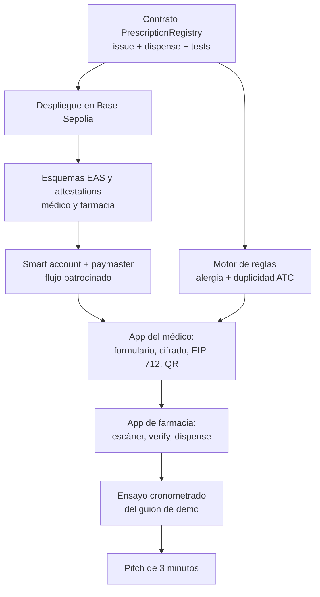

# 09 — Roadmap

Setenta y dos horas para llegar a un `revert` proyectado en pantalla. El plan se ordena por dependencias, no por horas de reloj, y tiene un corte claro: si al final del segundo día el flujo completo no funciona de extremo a extremo, se recortan las reglas clínicas y se conserva la demo.

## Fase 0 — Buildathon (72 horas)

### Orden de dependencias

### Qué se construye y en qué orden

| Bloque | Entregable | Criterio de salida | Recortable |
|---|---|---|---|
| 1. Contrato | `PrescriptionRegistry` con `issue`, `dispense`, `cancel`, `verify` | `test_dispense_twice_reverts` pasa | No |
| 2. Despliegue | Contrato verificado en Base Sepolia | Dirección pública y explorable | No |
| 3. Credenciales | Esquemas EAS y attestations de prueba | El contrato rechaza a una cuenta sin credencial | No |
| 4. Cuenta y gas | Smart account con passkey y paymaster operativo | Una emisión sin que el médico tenga ETH | No |
| 5. App del médico | Formulario, cifrado, firma EIP-712, QR | QR generado y legible | No |
| 6. App de farmacia | Escáner, verificación, dispensación | El segundo escaneo muestra el rechazo | No |
| 7. Reglas clínicas | Alergia declarada y duplicidad ATC | Una alerta visible en la demo | **Sí** |
| 8. Ensayo | Guion cronometrado bajo tres minutos | Tres pasadas seguidas sin fallos | No |

### Plan de recorte

Si el tiempo aprieta, se recorta en este orden y solo en este orden:

1. Reglas clínicas (bloque 7): la demo funciona sin ellas.
2. Aspecto visual de las aplicaciones: funcional y sobrio basta.
3. Función `cancel`: no aparece en el guion.
4. Registro off-chain elaborado: un JSON en Postgres es suficiente.

**No se recorta nunca:** el contrato, la verificación de credenciales, el paymaster ni el segundo escaneo rechazado.

### Riesgos del buildathon

| Riesgo | Probabilidad | Impacto | Mitigación |
|---|---|---|---|
| El precompilado P-256 no está disponible en Base Sepolia | Media | Alto | Verificar el primer día; alternativa: verificación P-256 en Solidity, o firma secp256k1 con clave generada en el navegador |
| El proveedor de bundler o paymaster falla | Media | Alto | Segundo proveedor configurado desde el inicio |
| Integración con EAS más lenta de lo previsto | Media | Medio | Alternativa: registro de credenciales propio en veinte líneas de Solidity, documentando que EAS es el destino |
| El equipo no domina Foundry | Baja | Alto | Hardhat como alternativa, decidida en las primeras horas y no después |
| El cifrado en el navegador consume más tiempo del previsto | Media | Medio | WebCrypto API nativa, sin dependencias |
| La demo falla en vivo | Media | Muy alto | Vídeo de respaldo y capturas preparadas |

## Fase 1 — Validación del problema

Puede ejecutarse en paralelo al buildathon y no depende de código.

| Objetivo | Entrevistar a médicos y farmacéuticos de Cochabamba |
|---|---|
| Alcance | De cinco a diez conversaciones con el guion de [00, D-23](00-vision-y-alcance.md). Incluye relevar qué software de gestión usan hoy las farmacias (pregunta 5 del guion), insumo de [D-26](#d-26) |
| Criterio de salida | Saber si la falsificación y la reutilización son problemas reales y percibidos, o si el problema prioritario es otro |
| Riesgo | Que la respuesta invalide la hipótesis. Es preferible saberlo ahora |

## Fase 2 — Producto mínimo utilizable

| Objetivo | Que una clínica y una farmacia puedan usarlo de verdad |
|---|---|
| Alcance | Tratamiento crónico y dispensación fraccionada ([D-12](04-smart-contracts.md)); modo sin conectividad ([D-20](04-smart-contracts.md)); cuenta y clave del paciente ([D-09](05-almacenamiento-y-cifrado.md)); integración de firma ADSIB ([D-17](07-seguridad-y-cumplimiento.md)); emisor real de credenciales ([D-03](02-roles-y-permisos.md)); catálogo de medicamentos ([D-07](03-modelo-de-datos.md)); historial off-chain del establecimiento como contexto clínico ([D-25](06-validacion-clinica.md)); API de integración con el software de gestión de farmacia ([D-26](#d-26)) |
| Criterio de salida | Cien recetas reales emitidas y dispensadas sin incidencias |
| Dependencias | Fase 1 completada; acuerdo con una clínica y una farmacia |
| Riesgos | La firma ADSIB puede resultar impracticable desde una aplicación web; el emisor de credenciales puede tardar meses en constituirse |

### Integración con el software de gestión de farmacia

> **Decisión pendiente — D-26: integración con el software de gestión de farmacia**
>
> **Contexto.** En [10](10-estado-del-arte.md) diagnosticamos que el obstáculo de Prescrypto, el único despliegue latinoamericano real de la tabla comparativa, fue la falta de integración con los flujos existentes de clínicas y farmacias. Sin embargo, este roadmap no contemplaba integración alguna en ninguna fase: una contradicción entre nuestro propio diagnóstico y nuestro plan. El informe base sí recogía la idea, aunque con nombres de software de gestión del mercado español sin presencia conocida en Bolivia, y al retirar esas marcas se perdió también el concepto (ver las referencias retiradas en [10](10-estado-del-arte.md)). Una farmacia ya tiene un sistema en el mostrador para inventario, facturación y control; pedirle que abra una segunda aplicación en cada dispensación es pedirle que cambie su flujo, y eso es exactamente lo que Prescrypto no consiguió.
>
> **Opciones.** (a) Aplicación independiente en el mostrador: la farmacia escanea y dispensa desde nuestra aplicación web, sin tocar su software. (b) API para que el software de gestión existente consulte la receta y registre la dispensación desde su propia interfaz, con la smart account de la farmacia firmando por detrás. (c) Ambas, por fases: (a) primero y (b) cuando se sepa qué software hay que integrar.
>
> **Recomendación.** Opción (c). El MVP es (a), porque en setenta y dos horas no hay nada que integrar y la demo exige una pantalla propia. La Fase 2 expone la API de (b), precedida por el relevamiento de qué software usan las farmacias de Cochabamba, que ya es la pregunta 5 del guion de entrevista de [00](00-vision-y-alcance.md): no se diseña un adaptador para un software que no se ha visto. El puerto correspondiente queda declarado en la capa de integraciones de [01](01-arquitectura.md). No se nombra ningún proveedor hasta tener ese relevamiento.
>
> **Impacto si se difiere.** Sin integración, la adopción depende de que cada farmacia cambie su flujo de trabajo, y ese es el motivo documentado por el que Prescrypto no escaló. El riesgo "las farmacias no adoptan" de la tabla de riesgos de este documento pasa de probable a casi seguro.

## Fase 3 — Extensiones

Cada una es un proyecto en sí mismo. Se listan para acotar expectativas, no como compromiso.

**Trazabilidad desde el laboratorio.** Vincular la dispensación con la unidad física exige serialización GS1 (GTIN, número de serie, lote, caducidad) y acuerdos con fabricantes e importadores. Los códigos ATC no sirven para esto: clasifican fármacos, no rastrean unidades. Ver [D-21](#d-21).

**Telemedicina y verificación biométrica.** Prescripción a distancia con verificación de identidad del paciente y del médico. Requiere análisis legal boliviano previo, tratamiento de datos biométricos y una posición clara sobre qué se puede prescribir sin examen presencial.

**Interoperabilidad con el sector público.** Integración con SNIS y con el marco del SUS bajo Ley 1152, mediante recursos HL7 FHIR R4.

**Privacidad reforzada.** Direcciones seudónimas por receta y pruebas de conocimiento cero para demostrar credencial vigente sin revelar identidad. Ver [D-06](03-modelo-de-datos.md).

> **Decisión pendiente — D-21**
> **Contexto.** El informe base promete trazabilidad desde el laboratorio apoyándose en códigos ATC, lo cual es técnicamente imposible. La trazabilidad de unidades exige serialización.
> **Opciones.** (a) Abandonar la promesa de trazabilidad de unidades y centrarse en la receta. (b) Adoptar GS1 con GTIN, serie y lote, y buscar acuerdos con laboratorios. (c) Trazabilidad parcial a nivel de lote sin serialización unitaria.
> **Recomendación.** Opción (a) hasta completar la Fase 2. La trazabilidad de la cadena de suministro es un producto distinto, con otros clientes y otro modelo de negocio. Mezclarlo con la receta electrónica dispersa el foco.
> **Impacto si se difiere.** Ninguno técnico. Pero si el pitch promete trazabilidad de medicamentos, un jurado con conocimiento farmacéutico detectará el error y perderemos credibilidad.

## Riesgos del programa

| Riesgo | Probabilidad | Impacto | Mitigación |
|---|---|---|---|
| El problema no es prioritario en Bolivia | Media | Muy alto | Fase 1 antes de invertir más |
| La firma ADSIB no es integrable desde web | Media | Alto | Diseño ya preparado para doble firma; alternativas de validez legal a explorar |
| No aparece un emisor institucional de credenciales | Alta | Alto | Puente con la clínica como emisor de primer nivel |
| Vacío regulatorio en protección de datos | Alta | Medio | Adopción voluntaria declarada de un estándar de referencia |
| Las farmacias no adoptan por falta de incentivo | Alta | Muy alto | Ver [13 Pitch y sostenibilidad](13-pitch-y-sostenibilidad.md) |
| El sistema no se integra con el software que la farmacia ya usa | Alta | Muy alto | [D-26](#d-26): aplicación independiente en el MVP, API en Fase 2, relevamiento en Fase 1 |
| Coste de gas en mainnet por encima de lo asumido | Baja | Medio | Medir en el buildathon, no estimar |
| El equipo se dispersa tras el buildathon | Media | Alto | Definir el siguiente entregable antes de terminar el evento |

## Siguiente paso

Continuar con [10-estado-del-arte.md](10-estado-del-arte.md).
