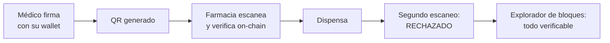
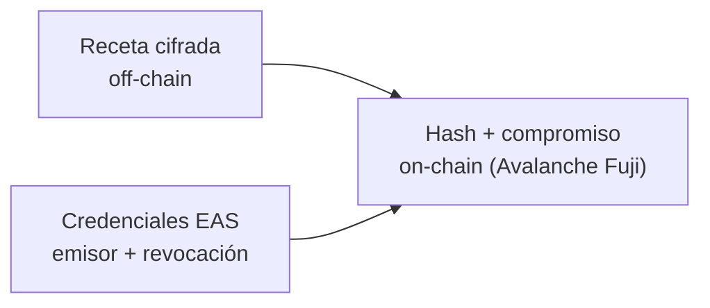
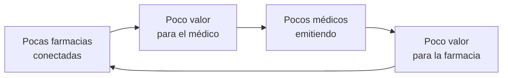

# 13 — Pitch y sostenibilidad

Tres minutos, siete bloques, un solo momento que el jurado debe recordar: el segundo escaneo rechazado. Todo lo demás es preparación para llegar a esa pantalla y contexto para salir de ella. Este documento fija el orden, lo que se dice en cada bloque y quién pagaría esto si funcionara.

> **El formato son 5 minutos: 3 de showcase y 2 de preguntas.** Los siete bloques de abajo ocupan los 3 minutos de showcase. Los 2 minutos restantes son de preguntas y se preparan con [12-preguntas-de-jurado.md](12-preguntas-de-jurado.md). Ver [15](15-track-y-entrega.md) para el resto de las reglas de entrega.

## Estructura del pitch

| # | Bloque | Tiempo | Qué se dice |
|---|---|---|---|
| 1 | Problema | 25 s | Una situación concreta y local, no una estadística global |
| 2 | Solución en una frase | 15 s | Qué hace el sistema, sin jerga |
| 3 | **Demo** | 80 s | El flujo completo hasta el rechazo |
| 4 | Arquitectura | 25 s | Un diagrama, tres cajas |
| 5 | Qué lo hace Ethereum-nativo | 25 s | Lo que el jurado técnico quiere oír |
| 6 | Roadmap y honestidad | 20 s | Qué falta y qué no prometemos |
| 7 | Equipo y pedido | 10 s | Quiénes somos y qué necesitamos |

> **El bloque 3 es la mitad del tiempo.** Si algo se recorta, no es la demo.

### 1. Problema (25 s)

Contar una escena, no un dato: un paciente llega a una farmacia con una receta en papel; el farmacéutico no tiene forma de saber si esa receta la firmó un médico con matrícula vigente ni si ya fue dispensada esa mañana en la farmacia de la esquina.

> **No inventar cifras bolivianas.** Si se quiere un número, decir con todas las letras de dónde sale: "en los trabajos que revisamos, todos de otros países…". La honestidad sobre la falta de datos locales se convierte en el bloque 6.

> **El ancla local que sí tenemos, sin necesidad de cifras.** Bolivia ya resuelve esto en papel para los medicamentos más sensibles: el recetario valorado que emite el SEDES es una receta numerada por una autoridad, de un solo uso, que la farmacia retiene y asienta en un libro de control. Existe, funciona y se falsifica. Nombrarlo en el bloque 1 o en el 5 demuestra que se entiende el problema local sin inventar un dato. Ver [07](07-seguridad-y-cumplimiento.md).

### 2. Solución en una frase (15 s)

> Una receta médica que la farmacia puede verificar en segundos y que el sistema impide reutilizar, sobre Avalanche con los estándares de firma de Ethereum, con el objetivo de que el médico nunca tenga que saber qué es una wallet.

### 3. Demo (80 s)

| Momento | Qué se muestra | Qué se dice |
|---|---|---|
| 0-20 s | El médico completa la receta y la firma | "Firma datos que lee en pantalla, no un hash" |
| 20-35 s | Aparece el QR | "Esto es lo único que el paciente se lleva" |
| 35-55 s | La farmacia escanea, ve la receta, dispensa | "La farmacia acaba de comprobar contra la cadena que quien firmó tiene matrícula vigente" |
| 55-70 s | Segundo escaneo del mismo QR | **"Rechazada. Ya fue dispensada hace treinta segundos."** Pausa |
| 70-80 s | Explorador de bloques con las dos transacciones | "Esto no lo decimos nosotros: está en la cadena y cualquiera lo puede verificar" |

> Ensayar hasta que el rechazo caiga siempre antes del segundo 70. Ver contingencias en [08](08-stack-y-entorno.md).

### 4. Arquitectura (25 s)

Un diagrama, tres cajas y una frase: on-chain va el hash, off-chain va la receta cifrada, y las credenciales profesionales son attestations revocables.

### 5. Qué lo hace Ethereum-nativo (25 s)

Cuatro nombres, una frase cada uno. Este bloque es el que separa un proyecto de blockchain genérico de uno que entiende el ecosistema.

| Pieza | La frase |
|---|---|
| ERC-4337 y paymaster | "El paymaster está escrito y probado: patrocina solo a cuentas con credencial vigente, para que el médico nunca compre AVAX. Todavía no está desplegado ni financiado, así que hoy el médico paga su propio gas de prueba" |
| Passkeys y RIP-7212 | "El contrato ya verifica la aserción WebAuthn y esa curva contra el precompilado que comprobamos en Fuji. Falta desplegarlo y enchufarlo a la app: la firma con huella está construida, no en uso" |
| EIP-712 | "Firma datos legibles off-chain: ve en texto claro qué prescribe y hasta cuándo, no una cadena hexadecimal" |
| EAS | "La matrícula es una attestation revocable: si la pierde, deja de emitir al instante" |

### 6. Roadmap y honestidad (20 s)

Lo que falta, dicho antes de que lo pregunten: firma ADSIB para validez legal en Bolivia, recetas crónicas, y validar el problema con médicos y farmacéuticos de Cochabamba, porque nuestra fuente es investigación de otros países.

> Este bloque parece una debilidad y es lo contrario: un jurado que oye "no hemos validado esto" deja de buscar el hueco y empieza a escuchar.

### 7. Equipo y pedido (10 s)

Quiénes somos, qué sabemos hacer y qué necesitamos: contacto con el Colegio Médico y con una farmacia dispuesta a probarlo.

## Métricas objetivo

Tres números y nada más. Se miden durante el buildathon; si no se miden, no se dicen.

| Métrica | Definición | Estado |
|---|---|---|
| **Tiempo de verificación en mostrador** | Segundos desde el escaneo hasta el veredicto en pantalla | Por medir en el buildathon |
| **Coste por receta** | Gas de `issue` más `dispense`, convertido a moneda | Por medir en el buildathon |
| **Pasos de criptomoneda para el médico** | Cuentas creadas, extensiones instaladas, tokens comprados | **Cero.** Es el único número que ya podemos afirmar |

> El tercero es el más fuerte de los tres, porque es el que ningún competidor del sector puede igualar sin abstracción de cuenta.

## Sostenibilidad: quién paga esto

El proyecto no tiene token, no cobra al paciente y no monetiza datos de salud. Esas tres exclusiones son deliberadas y conviene declararlas.

| Pagador candidato | Por qué pagaría | Obstáculo |
|---|---|---|
| **Cajas de salud y seguros** | Evidencia verificable de dispensación por receta, que reduce el fraude en reembolsos | Ciclo de venta institucional largo |
| **Cadenas farmacéuticas** | Rechazar recetas ya dispensadas y dejar evidencia ante auditoría | Necesitan que los médicos ya estén emitiendo: problema del huevo y la gallina |
| **Clínicas privadas** | Diferenciación y reducción de errores de transcripción | Poca presión para cambiar lo que ya funciona |
| **SEDES Cochabamba** | Piloto de salud digital departamental; agregados por prescriptor, farmacia, ATC y periodo; base para vigilancia de sustancias controladas | Tiempos y presupuestos públicos |
| Laboratorios | Interés en trazabilidad | Es otro producto. Ver [D-21](09-roadmap.md) |
| Pacientes | Ninguno directo | **Descartado por equidad** |

> **Lo que no se ofrece a ningún pagador.** Tendencias de salud pública por paciente ni perfiles de consumo individual: la sal única por receta lo hace imposible por diseño y el proyecto no monetiza datos de salud. Lo que el Estado y los pagadores pueden recibir son agregados sin identidad de paciente. Ver [03](03-modelo-de-datos.md) y [02](02-roles-y-permisos.md).

### El problema del huevo y la gallina

La forma de romperlo es empezar por un circuito cerrado: **una clínica y las farmacias de su entorno inmediato**, donde el flujo de pacientes entre ambas ya existe. No se busca cobertura nacional, se busca que en un radio de pocas cuadras el sistema tenga sentido desde el primer día.

> **Decisión pendiente — D-22**
> **Contexto.** Sin modelo de sostenibilidad, el proyecto termina cuando termina el buildathon. Ninguna de las opciones está validada con un pagador real.
> **Opciones.** (a) Software como servicio cobrado a clínicas y farmacias por suscripción. (b) Convenio con un ente público que financie el patrocinio de gas y la operación. (c) Financiación puente del ecosistema Ethereum, sin emitir token, para sostener el piloto mientras se consigue un pagador. (d) Gratuito hasta un umbral de recetas, luego por suscripción institucional.
> **Recomendación.** La opción (c) es pista de despegue, no modelo de sostenibilidad: cubre la Fase 1 y el piloto, y se agota. El modelo es (b) o (d), y la validación de D-23 decide cuál. Dentro de (c), el orden importa porque la mayoría de estos programas premia trabajo ya desplegado; ver la tabla siguiente, donde además tres de las seis vías dejaron de aplicar con el cambio de red.
> **Impacto si se difiere.** El proyecto no sobrevive al evento y el trabajo se pierde.

### Financiación del ecosistema Ethereum: qué es cada programa

Ninguno exige emitir un token. Casi todos exigen haber desplegado antes de pedir.

| Programa | Naturaleza | Cuándo aplica | Encaje con este proyecto |
|---|---|---|---|
| Base Builder Grants | Retroactivo, 1 a 5 ETH, sin formulario: el equipo de Base identifica proyectos por actividad en el ecosistema | **Ya no aplica.** Exige actividad en Base, y el proyecto migró a Avalanche Fuji | Nulo desde el cambio de red. La fila se conserva para dejar constancia de que era la vía más directa que teníamos y de por qué desapareció |
| Ethereum Foundation, Next Billion Fellowship | Fellowship con estipendio para proyectos de impacto real orientados a los próximos mil millones de usuarios; aplicación continua | Con el piloto en marcha y una persona del equipo que lo lidere | Alto. Es el programa de la EF que encaja; el ESP no |
| Optimism Retro Funding (antes RetroPGF) | Retroactivo. Evalúa impacto de los últimos 180 días de actividad on-chain en la Superchain; exige contratos desplegados, código público y KYC | **Ya no aplica.** Solo puntúa actividad on-chain en cadenas de la Superchain, y Avalanche no es una de ellas | Nulo desde el cambio de red |
| Gitcoin Grants Program | Financiación cuadrática: el matching depende del número de donantes de la comunidad. Grants Stack y Grants Lab cerraron en mayo de 2025; las rondas continúan | En cualquier ronda abierta | Bajo. Sin comunidad cripto-nativa que done, el resultado es simbólico |
| Ethereum Foundation, ESP | Subvenciones a infraestructura core: criptografía, ZK, auditorías, investigación de protocolo | No aplica | Nulo para una aplicación de salud. Se lista para no confundirlo con la fellowship |
| Base Ecosystem Fund | Capital de riesgo de Coinbase Ventures, dilutivo | **Ya no aplica**, y tampoco era una subvención | Nulo. Se listaba para no confundirlo con Builder Grants |

> **Tres de las seis vías caen con la migración a Avalanche Fuji.** Las dos de Base y la de la Superchain dependían de desplegar en una cadena que ya no usamos, así que dejan de ser opciones y no se sustituyen por nada todavía. `VERIFICAR:` qué programas de subvención o financiación existen en el ecosistema Avalanche, con qué requisitos, montos y plazos. **No tenemos ni un solo dato comprobado sobre ellos**, y hasta tenerlo ninguno se nombra en el pitch ni se planifica sobre su existencia. `VERIFICAR:` también si las dos filas que no dependen de una cadena concreta (la fellowship de la Ethereum Foundation y Gitcoin) exigen despliegue en Ethereum o en un L2, porque si lo exigen también caen.

`VERIFICAR:` montos, plazos y criterios de cada programa cambian con frecuencia. Los de esta tabla corresponden a septiembre de 2026 y deben confirmarse en la fuente oficial antes de citarlos en el pitch.

## Lo que no decimos nunca en el pitch

| No decir | Decir en su lugar |
|---|---|
| "Elimina el fraude de recetas" | "Elimina la reutilización y verifica al emisor" |
| "Es completamente privado" | "El contenido está cifrado; los metadatos de la cadena son públicos y lo decimos" |
| "Usamos IA" | "Es un motor de reglas determinístico, y por eso es auditable" |
| "Cumple el RGPD" | "Adoptamos minimización y cifrado por decisión propia; el marco boliviano tiene huecos" |
| "Tiene validez legal" | "La doble firma con ADSIB está diseñada y es nuestro siguiente entregable" |
| "Trazamos el medicamento" | "Trazamos la receta. La trazabilidad de unidades necesita GS1 y es otro producto" |
| "Permite supervisar tendencias de salud pública" | "Permite agregados por prescriptor, farmacia, ATC y periodo; nunca por paciente" |
| Cualquier cifra no medida | "Todavía no lo hemos medido" |

## Siguiente paso

Continuar con [14-trazabilidad-informe-base.md](14-trazabilidad-informe-base.md) para defender cada cambio respecto al informe base, o repasar [12-preguntas-de-jurado.md](12-preguntas-de-jurado.md) antes de subir al escenario.
